# **KS5005(KS5006)Keyestudio ESP32 37 in 1 Sensor Kit**

You need to look through the file“Preparation before class for
Python”first before get started with this kit.

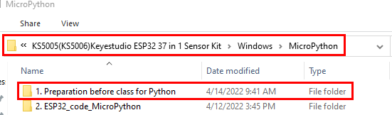

## 1. Description：

The Keyestudio ESP32 37 in 1 sensor kit mainly contains 37 commonly used
sensors and modules, an ESP32 board, an ESP32 expansion board and Dupont
wires.

All sensors and modules are fully compatible with the ESP32 expansion
board. You only need to stack the ESP32 mainboard onto the ESP32
expansion Board, and hook up them with Dupont wires, which is simple and
convenient.

To make you master the electronic knowledge, detailed tutorials,
schematic diagrams, wiring methods and test code are included. Through
these projects, you will have a better understanding about programming,
logic and electronics.

## 2. Kit：

(Note: the ESP32 board is included in the KS5005 kit；but not in the
KS5006 kit)

<table>
<tbody>
<tr class="odd">
<td>#</td>
<td>Picture</td>
<td>Name</td>
<td>QTY</td>
</tr>
<tr class="even">
<td></td>
<td></td>
<td>Keyestudio LED Module</td>
<td>1</td>
</tr>
<tr class="odd">
<td></td>
<td></td>
<td>Keyestudio Common Cathode RGB Module</td>
<td>1</td>
</tr>
<tr class="even">
<td></td>
<td></td>
<td>Keyestudio Traffic Lights Module</td>
<td>1</td>
</tr>
<tr class="odd">
<td></td>
<td></td>
<td>Keyestudio Active Buzzer</td>
<td>1</td>
</tr>
<tr class="even">
<td></td>
<td></td>
<td>Keyestudio 8002b Audio Power Amplifier</td>
<td>1</td>
</tr>
<tr class="odd">
<td></td>
<td></td>
<td>Keyestudio Button Module</td>
<td>1</td>
</tr>
<tr class="even">
<td></td>
<td></td>
<td>Keyestudio Tilt Sensor</td>
<td>1</td>
</tr>
<tr class="odd">
<td></td>
<td></td>
<td>Keyestudio PIR Motion Sensor</td>
<td>1</td>
</tr>
<tr class="even">
<td></td>
<td></td>
<td>Keyestudio Obstacle Avoidance Sensor</td>
<td>1</td>
</tr>
<tr class="odd">
<td></td>
<td></td>
<td>Keyestudio 6812 RGB Module</td>
<td>1</td>
</tr>
<tr class="even">
<td></td>
<td></td>
<td>
Keyestudio NTC-MF52AT

Thermistor
</td>
<td>1</td>
</tr>
<tr class="odd">
<td></td>
<td></td>
<td>Keyestudio Photoresistor</td>
<td>1</td>
</tr>
<tr class="even">
<td></td>
<td></td>
<td>Keyestudio Sound Sensor</td>
<td>1</td>
</tr>
<tr class="odd">
<td></td>
<td></td>
<td>
Keyestudio

Rotary Potentiometer
</td>
<td>1</td>
</tr>
<tr class="even">
<td></td>
<td></td>
<td>Keyestudio IR Receiver</td>
<td>1</td>
</tr>
<tr class="odd">
<td></td>
<td></td>
<td>Keyestudio Reed Switch Sensor</td>
<td>1</td>
</tr>
<tr class="even">
<td></td>
<td></td>
<td>Keyestudio Rotary Encoder Module</td>
<td>1</td>
</tr>
<tr class="odd">
<td></td>
<td></td>
<td>Keyestudio Joystick Module</td>
<td>1</td>
</tr>
<tr class="even">
<td></td>
<td></td>
<td>Keyestudio HT16K33 8X8 Dot Matrix Module</td>
<td>1</td>
</tr>
<tr class="odd">
<td></td>
<td></td>
<td>Keyestudio TM1650 4-Digit Tube Display</td>
<td>1</td>
</tr>
<tr class="even">
<td></td>
<td></td>
<td>Keyestudio Thin-film Pressure Sensor</td>
<td>1</td>
</tr>
<tr class="odd">
<td></td>
<td></td>
<td>Keyestudio DS1307 Clock Sensor</td>
<td>1</td>
</tr>
<tr class="even">
<td></td>
<td></td>
<td>Keyestudio SR01 Ultrasonic Sensor</td>
<td>1</td>
</tr>
<tr class="odd">
<td></td>
<td></td>
<td>Servo</td>
<td>1</td>
</tr>
<tr class="even">
<td></td>
<td></td>
<td>Keyestudio Capacitive Sensor</td>
<td>1</td>
</tr>
<tr class="odd">
<td></td>
<td></td>
<td>Keyestudio Photo Interrupter</td>
<td>1</td>
</tr>
<tr class="even">
<td></td>
<td></td>
<td>Keyestudio Hall Sensor</td>
<td>1</td>
</tr>
<tr class="odd">
<td></td>
<td></td>
<td>Keyestudio Flame Sensor</td>
<td>1</td>
</tr>
<tr class="even">
<td></td>
<td></td>
<td>Keyestudio Line Tracking Sensor</td>
<td>1</td>
</tr>
<tr class="odd">
<td></td>
<td></td>
<td>Keyestudio Analog Gas Sensor</td>
<td>1</td>
</tr>
<tr class="even">
<td></td>
<td></td>
<td>Keyestudio XHT11 Temperature and Humidity Sensor</td>
<td>1</td>
</tr>
<tr class="odd">
<td></td>
<td></td>
<td>Keyestudio 18B20 Temperature Sensor</td>
<td>1</td>
</tr>
<tr class="even">
<td></td>
<td></td>
<td>Keyestudio 130 Motor</td>
<td>1</td>
</tr>
<tr class="odd">
<td></td>
<td></td>
<td>Fan</td>
<td>1</td>
</tr>
<tr class="even">
<td></td>
<td></td>
<td>Keyestudio Laser Module</td>
<td>1</td>
</tr>
<tr class="odd">
<td></td>
<td></td>
<td>Keyestudio Steam Sensor</td>
<td>1</td>
</tr>
<tr class="even">
<td></td>
<td></td>
<td>Keyestudio Relay Module</td>
<td>1</td>
</tr>
<tr class="odd">
<td></td>
<td></td>
<td>Keyestudio RFID Module</td>
<td>1</td>
</tr>
<tr class="even">
<td></td>
<td></td>
<td>Keyestudio ESP32 Development Board</td>
<td>1</td>
</tr>
<tr class="odd">
<td></td>
<td></td>
<td>Keyestudio ESP32-IO Expansion Board</td>
<td>1</td>
</tr>
<tr class="even">
<td></td>
<td></td>
<td>Keyestudio IR Remote Control</td>
<td>1</td>
</tr>
<tr class="odd">
<td></td>
<td></td>
<td>USB Cable</td>
<td>1</td>
</tr>
<tr class="even">
<td></td>
<td></td>
<td>F-F Dupont Wire</td>
<td>1</td>
</tr>
<tr class="odd">
<td></td>
<td></td>
<td>White Card</td>
<td>1</td>
</tr>
<tr class="even">
<td></td>
<td></td>
<td>ABS RFID Key</td>
<td>1</td>
</tr>
<tr class="odd">
<td></td>
<td></td>
<td>6 AA Battery Holder</td>
<td>1</td>
</tr>
</tbody>
</table>

## 3. Projects

There are 37 sensors and modules in this kit. Next, we will analyze and
introduce how they work step by step. Interface sensors with the ESP32
board and its expansion board, run test codes and observe experimental
phenomenon.

**Note: please wire up components according to the given connection
diagrams.**

**What’s more, wire up the power and signals correctly, otherwise,
sensors or modules will get damaged or no test results will be shown.**

### Project 1: Hello World

**Overview**

In this project, we will make an experiment to light up the white LED
module. The high and low levels can be controlled by programming, then
the state of the LED can be controlled.

**Required Components**

<table>
<tbody>
<tr class="odd">
<td></td>
<td></td>
</tr>
<tr class="even">
<td>ESP32*1</td>
<td>USB Cable *1</td>
</tr>
</tbody>
</table>

**Wire Up：**

Connect the ESP32 to your computer

**Running code online：**

To run the ESP32 online, you need to connect the ESP32 to the computer,
which allows you to compile or debug programs using Thonny software.  

Advantages:

1\. You can use the Thonny software to compile or debug programs.

2.Through the "Shell" window, you can view error messages and output
results generated during the running of the program as well as query
related function information online to help improve the program.  

Disadvantages:

1.  To run the ESP32 online, you must connect the ESP32 to a computer
    and run it with the Thonny software.  

<!-- end list -->

2.  If the ESP32 is disconnected from the computer , when they
    reconnect, the program won't run again.  

<!-- end list -->

1.  Open Thonny，and click“Open...”
    
    

2.  Click“This computer”in the new pop-up window.
    
    

Select“Project\_01\_HelloWorld.py”,click“Open”. The code used in this
tutorial is saved in the file KS5005(KS5006)Keyestudio ESP32 37 in
1 Sensor Kit\\Windows\\MicroPython\\2.ESP32\_code\_MicroPython.

You can move the code to anywhere, for example,we can save the
**2.ESP32\_code\_MicroPython in the** Disk(D), the route is
**D:\\2.ESP32\_code\_MicroPython.**（The code in this tutorial is saved
in the Disk(D) on your computer）

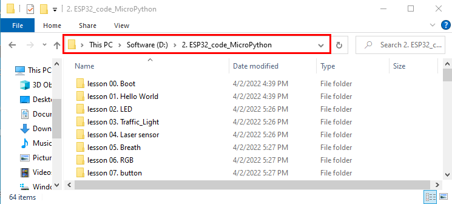

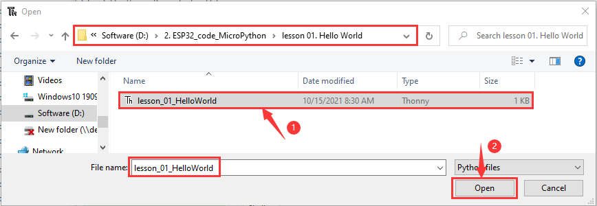

Click“Run current script”to execute the
program“Hello World\!”, "Welcome Keyestudio" , which will be printed
in the“Shell”window.

**Exit running online**

When running online, click “Stop /Restart
Backend”or press “Ctrl+C”on the Thonny to exit the program.  

**5.Test Code：**

<table>
<tbody>
<tr class="odd">
<td>
print("Hello World!")

print("Welcome Keyestudio")
</td>
</tr>
</tbody>
</table>

### Project 2: Lighting up LED

**Overview**

In this project, we will make an experiment to light up the white LED
module. The high and low levels can be controlled by programming, then
the state of the LED can be controlled.

**Working Principle**

The two circuit diagrams are given. The left one is wrong wiring-up
diagram. Why? Theoretically, when the S terminal outputs high levels,
LED will receive the voltage and light up.

Due to limitation of IO ports of Pico board, weak current can’t make LED
brighten.

The right one is correct wiring-up diagram. GND and VCC are powered up.
When the S terminal is a high level, the triode Q1 will be connected and
LED will light up(note: current passes through LED and R3 to reach GND
by VCC not IO ports). Conversely, when the S terminal is a low level,
the triode Q1 will be disconnected and LED will go off.

The triode Q1 is equal to a switch and R1 and R3 stand for limited
resistors which can curb the size of current to prevent from burning out
components

**3.Required Components**

<table>
<tbody>
<tr class="odd">
<td></td>
<td></td>
<td></td>
<td></td>
<td></td>
</tr>
<tr class="even">
<td>ESP32 Board*1</td>
<td>ESP32 Expansion Board*1</td>
<td>Keyestudio Purple LED Module*1</td>
<td>3P Dupont Wire*1</td>
<td>Micro USB Cable*1</td>
</tr>
</tbody>
</table>

**Wiring Diagram**

**Test Code：**

<table>
<tbody>
<tr class="odd">
<td>
from machine import Pin

import time

led = Pin(0, Pin.OUT)# Build an LED object, connect the external LED light to pin 0, and set pin 0 to output mode

while True:

led.value(1)# turn on led

time.sleep(1)# delay 1s

led.value(0)# turn off led

time.sleep(1)# delay 1s
</td>
</tr>
</tbody>
</table>

**Code Explanation**

**Machine** module is indispensable, we will use **import machine** or
**from machine import...** to program pico with microPython.

time.sleep() function is used to set delayed time, as
**time.sleep(0.01),** which means, the delayed time is 10ms.

1.  **led = Pin(0, Pin.OUT)**，created a pin example and we name **led.**
    
    **0** is indicative of connected pin GP0，**Pin.OUT represents output
    mode**， can use **.value() to output high levels**
    (3.3V)**led.value(1) or low levels** (0V)**led.value(0)**。
    
    **import machine** is used to import modules. When creating pins
    examples, it will change into **led = machine.Pin(0,
    machine.Pin.OUT)**
    
    **Test Result：**
    
    Wire up and click . Then LED will falsh.
    Press “Ctrl+C”or click  to exit the program

### Project 3: Traffic Lights Module

**Overview**

In this lesson, we will learn how to control multiple LED lights and
simulate the operation of traffic lights.

Traffic lights are signal devices positioned at road intersections,
pedestrian crossings, and other locations to control flows of traffic.

In this kit, we will use the traffic light module to simulate the
traffic light.

**Working Principle**

In previous lesson, we already know how to control an LED. In this part,
we only need to control three separated LEDs. Output high levels to the
signal R(3.3V), then the red LED will be on.

**Required Components**

<table>
<tbody>
<tr class="odd">
<td></td>
<td></td>
<td></td>
<td></td>
<td></td>
</tr>
<tr class="even">
<td>ESP32 Board*1</td>
<td>
ESP32 Expansion

Board*1
</td>
<td>Keyestudio Traffic Lights Module*1</td>
<td>5P Dupont Wire*1</td>
<td>Micro USB Cable*1</td>
</tr>
</tbody>
</table>

**Wiring Diagram**

**Test Code：**

<table>
<tbody>
<tr class="odd">
<td>
import machine

import time

led_red = machine.Pin(15, machine.Pin.OUT)

led_yellow = machine.Pin(2, machine.Pin.OUT)

led_green = machine.Pin(0, machine.Pin.OUT)

while True:

led_green.value(1) # green light turn on

time.sleep(5) # delay 5s

led_green.value(0) # green light turn off

for i in range(3): # yellow light blinks 3 times

led_yellow.value(1)

time.sleep(0.5)

led_yellow.value(0)

time.sleep(0.5)

led_red.value(1) # red light turn on

time.sleep(5) # delay 5s

led_red.value(0) #red light turn off
</td>
</tr>
</tbody>
</table>

**Code Explanation**

Create pins, set pins mode and delayed functions.

We use the **for** loop.

The simplest form is **for i in range()**.

In the code, we used range(3), which means the variable i starts from 0,
increase 1 for each time, to 2.

**Test Result**

Wire up, power on and click . We will see that
the green LED will be on for 5s then off, the yellow LED will flash for
3s then go off and the red one will be on for 5s then off.
Press“Ctrl+C”or clickto exit the program.

### Project 4: Laser Sensor

**Description**

Lasers are widely used to cut, weld, surface treat, and more on specific
materials. The energy of the laser is very high. The toy laser pointer
may cause glare to the human eye, and it may cause retinal damage for a
long time. my country also prohibits the use of laser to illuminate the
aircraft.

**Working Principle**

The laser head sensor module is mainly composed of a laser head with a
light-emitting die, a condenser lens, and a copper adjustable sleeve.

We can see the circuit schematic diagram of this module which is very
similar to the LED we have learned. They are all driven by triodes. A
high-level digital signal is directly input at the signal end, then the
sensor will start to work; if inputting low levels, the sensor won’t
work.

Note: don’t point an laser emitter at eyes of people.

**Required Components**

<table>
<tbody>
<tr class="odd">
<td></td>
<td></td>
<td></td>
<td></td>
<td></td>
</tr>
<tr class="even">
<td>ESP32 Board*1</td>
<td>ESP32 Expansion Board*1</td>
<td>Keyestudio Laser Module*1</td>
<td>3P Dupont Wire*1</td>
<td>Micro USB Cable*1</td>
</tr>
</tbody>
</table>

**Wiring Diagram**

**Test Code：**

<table>
<tbody>
<tr class="odd">
<td>
from machine import Pin

import time

laser = Pin(0, Pin.OUT)# Build a laser object, connect the laser to pin 0, and set pin 0 to output mode

while True:

laser.value(1) # Turn on the laser

time.sleep(2) # dalay 2s

laser.value(0) # Turn off the laser

time.sleep(2) # delay 2s
</td>
</tr>
</tbody>
</table>

**Code Explanation**

Please refer to project 2 above for the code setting instructions.

**Test Result**

Wire up, power on and click , the code starts
executing, we will see that the laser tube on the module emits a red
laser signal for 2 seconds, and stops emitting a red laser signal for 2
seconds. Press “Ctrl+C”or click “Stop/Restart
backend”to exit the program.

### Project 5: Breathing LED

1.  **Overview**

A“breathing LED”is a phenomenon where an LED's brightness smoothly
changes from dark to bright and back to dark, continuing to do so and
giving the illusion of an LED“breathing. This phenomenon is similar to a
lung breathing in and out. So how to control LED’s brightness? We need
to take advantage of PWM.

**2.Required Components**

<table>
<tbody>
<tr class="odd">
<td></td>
<td></td>
<td></td>
<td></td>
<td></td>
</tr>
<tr class="even">
<td>ESP32 Board*1</td>
<td>ESP32 Expansion Board*1</td>
<td>Keyestudio Purple LED Module*1</td>
<td>3P Dupont Wire*1</td>
<td>Micro USB Cable*1</td>
</tr>
</tbody>
</table>

**3.Wiring Diagram**

**4.Test Code：**

<table>
<tbody>
<tr class="odd">
<td>
import time

from machine import Pin,PWM

#The way that the ESP32 PWM pins output is different from traditionally controllers.

#It can change frequency and duty cycle by configuring PWM’s parameters at the initialization stage.

#Define GPIO 0’s output frequency as 10000Hz and its duty cycle as 0, and assign them to PWM.

pwm =PWM(Pin(0,Pin.OUT),10000,0)

try:

while True:

#The range of duty cycle is 0-1023, so we use the first for loop to control PWM to change the duty

#cycle value,making PWM output 0% -100%; Use the second for loop to make PWM output 100%-0%.

for i in range(0,1023):

pwm.duty(i)

time.sleep_ms(1)

for i in range(0,1023):

pwm.duty(1023-i)

time.sleep_ms(1)

except:

#Each time PWM is used, the hardware Timer will be turned ON to cooperate it. Therefore, after each use of PWM,

#deinit() needs to be called to turned OFF the timer. Otherwise, the PWM may fail to work next time.

pwm.deinit()
</td>
</tr>
</tbody>
</table>

**5.Test Result**

Wire up and power on and click “Run current
script”, the code starts executing, we will see that the LED on the
module gradually gets dimmer then brighter, cyclically, like human
breathe. Press“Ctrl+C”or click“Stop/Restart
backend”to exit the program.

### Project 6: RGB Module

1.  **Overview**

Among these modules is a RGB module. It adopts a F10-full color RGB
foggy common cathode LED. We connect the RGB module to the PWM port of
MCU and the other pin to GND(for common anode RGB, the rest pin will be
connected to VCC). So what is PWM?

PWM is a means of controlling the analog output via digital means.
Digital control is used to generate square waves with different duty
cycles (a signal that constantly switches between high and low levels)
to control the analog output.In general, the input voltages of ports are
0V and 5V. What if the 3V is required? Or a switch among 1V, 3V and
3.5V? We cannot change resistors constantly. For this reason, we resort
to PWM.

For Arduino digital port voltage outputs, there are only LOW and HIGH
levels, which correspond to the voltage outputs of 0V and 5V
respectively. You can define LOW as“0”and HIGH as“1’, and let the
Arduino output five hundred‘0’or“1”within 1 second. If output five
hundred‘1’, that is 5V; if all of which is‘0’,that is 0V; if output 250
01 pattern, that is 2.5V.

This process can be likened to showing a movie. The movie we watch are
not completely continuous. Actually, it generates 25 pictures per
second, which cannot be told by human eyes. Therefore, we mistake it as
a continuous process. PWM works in the same way. To output different
voltages, we need to control the ratio of 0 and 1. The more‘0’or‘1’
output per unit time, the more accurate the control.

2.  **Working Principle**

For our experiment, we will control the RGB module to display different
colors through three PWM values.

**3.Required Components**

<table>
<tbody>
<tr class="odd">
<td></td>
<td></td>
<td></td>
<td></td>
<td></td>
</tr>
<tr class="even">
<td>ESP32 Board*1</td>
<td>ESP32 Expansion Board*1</td>
<td>Keyestudio DIY Common Cathode RGB *1</td>
<td>4P Dupont Wire*1</td>
<td>Micro USB Cable*1</td>
</tr>
</tbody>
</table>

**4.Wiring Diagram**

**5.Test Code：**

<table>
<tbody>
<tr class="odd">
<td>
# import Pin, PWM and Random function modules.

from machine import Pin, PWM

from random import randint

import time

#Configure ouput mode of GPIO0, GPIO2 and GPIO15 as PWM output and PWM frequency as 10000Hz.

pins = [0, 2, 15]

pwm0 = PWM(Pin(pins[0]),10000)

pwm1 = PWM(Pin(pins[1]),10000)

pwm2 = PWM(Pin(pins[2]),10000)

#define a function to set the color of RGBLED.

def setColor(r, g, b):

pwm0.duty(1023-r)

pwm1.duty(1023-g)

pwm2.duty(1023-b)

try:

while True:

red = randint(0, 1023)

green = randint(0, 1023)

blue = randint(0, 1023)

setColor(red, green, blue)

time.sleep_ms(200)

except:

pwm0.deinit()

pwm1.deinit()

pwm2.deinit()
</td>
</tr>
</tbody>
</table>

3.  **Test Result**

Wire up and power on. Click “Run current script”,
the code starts executing, we will see that the RGB LED on the module
starts to display random colors. Press“Ctrl+C”or click
“Stop/Restart backend”to exit the program.

### Project 7: Button Sensor

1.  **Overview**

In this kit, there is a Keyestudio single-channel button module, which
mainly uses a tact switch and comes with a yellow button cap.

In previous lessons, we learned how to make the pins of our single-chip
microcomputer output a high level or low level. In this experiment, we
will read the high level (3.3V) and low level (0V).

We can determine whether the button on the sensor is pressed by reading
the high and low level of the S terminal on the sensor.

2.  **Working Principle**

The button module has four pins. The pin 1 is connected to the pin 3 and
the pin 2 is linked with the pin 4. When the button is not pressed, they
are disconnected. Yet, when the button is pressed, they are connected.
If the button is released, the signal end is high level.

**3.Required Components**

<table>
<tbody>
<tr class="odd">
<td></td>
<td></td>
<td></td>
<td></td>
<td></td>
</tr>
<tr class="even">
<td>ESP32 Board*1</td>
<td>ESP32 Expansion Board*1</td>
<td>Keyestudio DIY Button Module*1</td>
<td>3P Dupont Wire*1</td>
<td>Micro USB Cable*1</td>
</tr>
</tbody>
</table>

**4.Wiring Diagram**

**5.Test Code：**

<table>
<tbody>
<tr class="odd">
<td>
from machine import Pin

import time

button = Pin(15, Pin.IN, Pin.PULL_UP)

while True:

if button.value() == 0:

print("You pressed the button!") #Press to print the corresponding information.

else:

print("You loosen the button!")

time.sleep(0.1) #delay 0.1s
</td>
</tr>
</tbody>
</table>

3.  **Code Explanation**

**button = Pin(15, Pin.IN, Pin.PULL\_UP),** we define the pin of the
button as GP15 and set to PULL-UP mode

We can use **button = Pin(15, Pin.IN) to set INPUT mode,** at this time,
the pins are in high resistance state.

1.  **button.value(),** read levels of buttons. Function returns High or
    Low

2.  **if..else.. sentence,** when the logic judge is TRUE, the code
    under the if will be activated; otherwise, the code udder the else
    will be activated.

3.  When ESP32 detects the button pressed, the signal end is low level
    (GP 15 is low level). **button.value() is 0.** If the ESP32 detects
    the button unpressed, **button.value()** is 1 and else sentence will
    be activated.

**7. Test Result**

Wire up and power on. Click “Run current script”,
the code starts executing, the string will be displayed on the ”Shell“
window. When the button is pressed, the ”Shell“ window will show“You
pressed the button\!”；when the button is released，the ”Shell“ window
will show“You Loosen the button”; as shown below. Press “Ctrl+C”or
click“Stop/Restart backend”to exit the program.

### Project 8: Capacitive Sensor

1.  **Description**

In this kit, there is a capacitive touch module which mainly uses a
TTP223-BA6 chip. It is a touch detection chip, which provides a touch
button, and its function is to replace the traditional button with a
variable area button. When we power on, the sensor needs about 0.5
seconds to stabilize. Do not touch the keys during this time period. At
this time, all functions are disabled, and self-calibration is always
performed. The calibration period is about 4 seconds. We display the
test results in the shell.

**2. Working Principle**

When our fingers touch the module, the signal S outputs high levels, the
red LED on the module flashes. We can determine if the button is pressed
or not by reading high and low levels on the sensor.

**3.Required Components**

<table>
<tbody>
<tr class="odd">
<td></td>
<td></td>
<td></td>
<td></td>
<td></td>
</tr>
<tr class="even">
<td>ESP32 Board*1</td>
<td>ESP32 Expansion Board*1</td>
<td>Keyestudio Capacitive Module</td>
<td>3P Dupont Wire*1</td>
<td>Micro USB Cable*1</td>
</tr>
</tbody>
</table>

**4.Wiring Diagram**

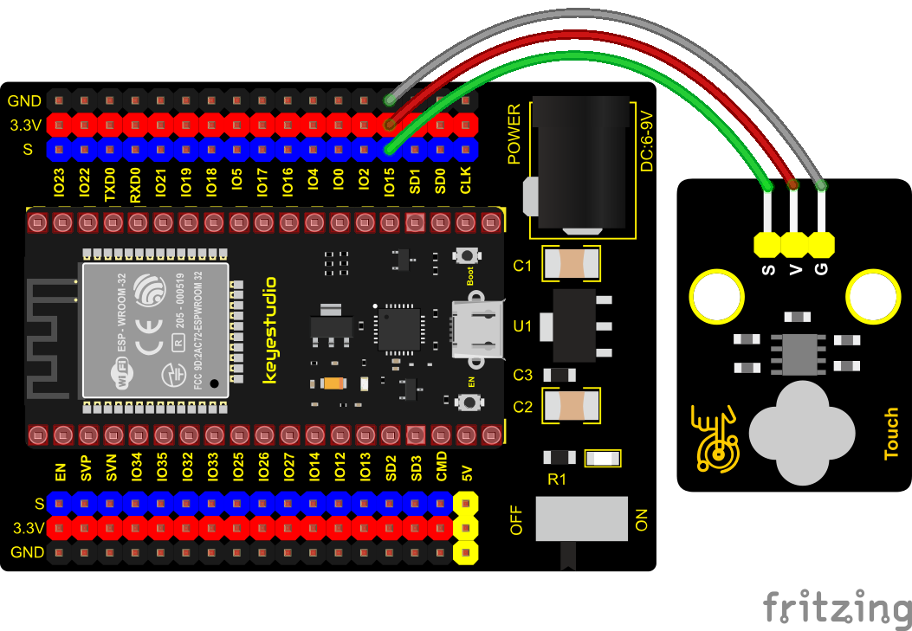

**5.Test Code：**

<table>
<tbody>
<tr class="odd">
<td>
from machine import Pin

import time

touch = Pin(15, Pin.IN, Pin.PULL_UP)

while True:

if touch.value() == 1:

print("You pressed the button!") #Press to print the corresponding information.

else:

print("You loosen the button!")

time.sleep(0.1) #delay0.1s
</td>
</tr>
</tbody>
</table>

**6. Code Explanation**

When we touch the sensor, the Shell monitor will show“You pressed the
button\!”, if not,“You loosen the button\!”will be shown on the monitor.

**7. Test Result**

Connect the wires according to the experimental wiring diagram and
poweron. Click “Run current script”, the code
starts executing, the string will be displayed in the ”Shell“ window.
when the button is pressed, the red LED lights up and val is 1.Then the
shell shows“You pressed the button\!”; if the button is released, the
red LED is off and val is 0;“You loosen the button\!”will be displayed,
as shown below. Press“Ctrl+C”or
click“Stop/Restart backend”to exit the program.

### Project 9: Obstacle Avoidance Sensor

1.  **Overview**

In this kit, there is a Keyestudio obstacle avoidance sensor, which
mainly uses an infrared emitting and a receiving tube. In the
experiment, we will determine whether there is an obstacle by reading
the high and low level of the S terminal on the sensor.

**2. Working Principle**

NE555 circuit provides IR signals with frequency to the emitter TX, then
the IR signals will fade with the increase of transmission distance. If
encountering the obstacle, it will be reflected back.

When the receiver RX meets the weak signals reflected back, the
receiving pin will output high levels, which indicates the obstacle is
far away. On the contrary, it the reflected signals are stronger, low
levels will be output, which represents the obstacle is close. There are
two potentiometers on the module, and one is for adjusting emission
power, another one is for receiving
frequency.

**3.Required Components**

<table>
<tbody>
<tr class="odd">
<td></td>
<td></td>
<td></td>
<td></td>
<td></td>
</tr>
<tr class="even">
<td>ESP32 Board*1</td>
<td>ESP32 Expansion Board*1</td>
<td>Keyestudio Obstacle Avoidance Sensor*1</td>
<td>3P Dupont Wire*1</td>
<td>Micro USB Cable*1</td>
</tr>
</tbody>
</table>

**4.Wiring Diagram**

**5.Test Code：**

<table>
<tbody>
<tr class="odd">
<td>
from machine import Pin

import time

sensor = Pin(15, Pin.IN)

while True:

if sensor.value() == 0:

print("There are obstacles")

else:

print("All going well")

time.sleep(0.1)
</td>
</tr>
</tbody>
</table>

**6. Code Explanation：**

The setting method is similar to project 7

**Note:**

Connect the wires according to the connection diagram. After powering
on, we start to adjust the two potentiometers to sense distance.

1.  Adjust the potentiometer transmitting power. Make the P LED at the
    critical point of ON and OFF states.

2\. Adjust the potentiometer receiving frequency. Rotate it clockwise,
the frequency will increase. Make the S LED at the critical point of ON
and OFF states, then the 38KHz square wave can be produced.

**7. Test Result**

Wire up and power on. Click “Run current script”,
the code starts executing, the string will be displayed in the ”Shell“
window. When the sensor detects the obstacle, sensor.value() is 0，the
shell will show“There are obstacles”, if the obstacle is not detected,
sensor.value () is 1,“All going well”will be shown, as shown below.
Press “Ctrl+C”or click“Stop/Restart backend”to
exit the program.

### Project 10: Line Tracking Sensor

1.  **Description**

In this kit, there is a DIY electronic building block single-channel
line tracking sensor which mainly uses a TCRT5000 reflective black and
white line recognition sensor element.

In the experiment, we judge the color (black and white) of the object
detected by the sensor by reading the high and low levels of the S
terminal on the module; and display the test results on the shell.

**2. Working Principle**

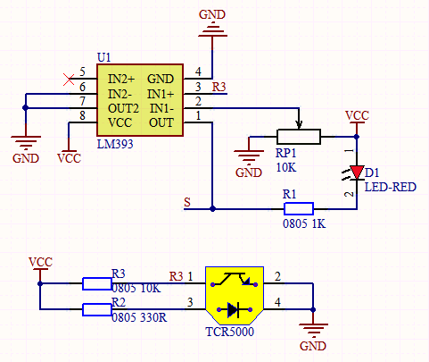When a black or no object is detected, the
signal terminal will output high levels; when white object is detected,
the signal terminal is low level; its detection height is 0-3cm. We can
adjust the sensitivity by rotating the potentiometer on the sensor. When
the potentiometer is rotated, the sensitivity is best when the red LED
on the sensor is at the critical point between off and on.

**3.Required Components**

<table>
<tbody>
<tr class="odd">
<td></td>
<td></td>
<td></td>
<td></td>
<td></td>
</tr>
<tr class="even">
<td>ESP32 Board*1</td>
<td>ESP32 Expansion Board*1</td>
<td>Keyestudio Line Tracking Sensor*1</td>
<td>3P Dupont Wire*1</td>
<td>Micro USB Cable*1</td>
</tr>
</tbody>
</table>

**4.Wiring Diagram**

**5.Test Code：**

<table>
<tbody>
<tr class="odd">
<td>
from machine import Pin

import time

sensor = Pin(15, Pin.IN, Pin.PULL_UP)

while True:

if sensor.value() == 0:

print("0 White") #Press to print the corresponding information.

else:

print("1 Black")

time.sleep(0.1) #delay 0.1s
</td>
</tr>
</tbody>
</table>

**6. Code Explanation**

The setting method is similar to project 7.

**7. Test Result**

Wire up and power on. Click “Run current script”,
the code starts executing, the string and data will be displayed in the
”Shell“ window. when the sensor doesn’t detect an object or detects a
black object, the val is 1, and the shell will display "Black" ; when a
white object (can reflect light) is detected, the val is 0, and the
shell displays "White" , as shown below. Press “Ctrl+C”or
click“Stop/Restart backend”to exit the program.

### Project 11: Photo Interrupter

**1. Description**

This kit contains a photo interrupter which mainly uses 1 ITR-9608
photoelectric switch. It is a photoelectric switch optical switch
sensor.

**2. Working Principle**

When the paper is put in the slot, C is connected with VCC and the
signal end S of the sensor are high levels; then the red LED will be
off. Otherwise, the red LED will be on.

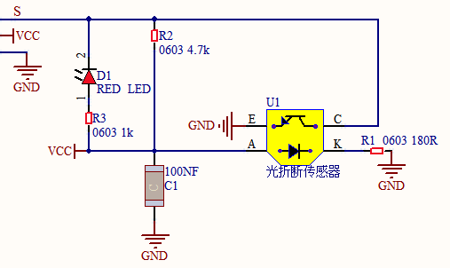

**3.Required Components**

<table>
<tbody>
<tr class="odd">
<td></td>
<td></td>
<td></td>
<td></td>
<td></td>
</tr>
<tr class="even">
<td>ESP32 Board*1</td>
<td>ESP32 Expansion Board*1</td>
<td>Keyestudio Photo Interrupter*1</td>
<td>3P Dupont Wire*1</td>
<td>Micro USB Cable*1</td>
</tr>
</tbody>
</table>

**4.Wiring Diagram**

**5.Test Code：**

<table>
<tbody>
<tr class="odd">
<td>
from machine import Pin

import time

sensor = Pin(15, Pin.IN, Pin.PULL_UP)

lastState = 0

PushCounter = 0

while True:

State = sensor.value()

if State != lastState:

if State == 1:

PushCounter += 1

print(PushCounter) #Press to print the corresponding information.

lastState = State
</td>
</tr>
</tbody>
</table>

**6. Code Explanation**

**Logic setting :**

<table>
<tbody>
<tr class="odd">
<td>Initial Setting</td>
<td>Set PushCounter to 0</td>
<td></td>
</tr>
<tr class="even">
<td></td>
<td>Set State to 0 (value of the sensor)</td>
<td></td>
</tr>
<tr class="odd">
<td></td>
<td>Set lastState to 0</td>
<td></td>
</tr>
<tr class="even">
<td>when an object enters the slot</td>
<td>lastState is 0，State turns into 1; lastState turns into 1</td>
<td>
Set PushCounter to PushCounter+1

print the value of PushCounter
</td>
</tr>
<tr class="odd">
<td>when the object leaves the slot</td>
<td>lastState is 1，State becomes 0，two data are not equal，lastState turns into 0.</td>
<td>
PushCounterdoesn’t change;

Don’t print the value of PushCounter
</td>
</tr>
<tr class="even">
<td>When the object goes through this slot again</td>
<td>lastState is 0, State becomes 1，two data are not equal，lastState turns into 1.</td>
<td>
Set PushCounter to PushCounter+1

And print the value of PushCounter
</td>
</tr>
<tr class="odd">
<td>When the object leaves this slot again</td>
<td>lastState is 1，State turns into 0，two data are not equal lastState turns into 0</td>
<td>
PushCounter doesn’t change;

Don’t print the PushCounter value
</td>
</tr>
</tbody>
</table>

**7. Test Result**

Wire up and power on. Click “Run current script”,
the code starts executing, data will be displayed in the ”Shell“ window.
Every time when the object passes through the slot of the sensor, the
PushCounter data will increase by 1 continuously, as shown below. Press
“Ctrl+C”or click“Stop/Restart backend”to exit
the program.

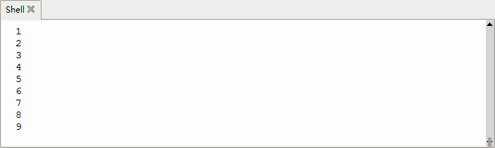

### Project 12: Tilt Module

1.  **Overview**

In this kit, there is a Keyestudio tilt sensor. The tilt switch can
output signals of different levels according to whether the module is
tilted. There is a ball inside. When the switch is higher than the
horizontal level, the switch is turned on, and when it is lower than the
horizontal level, the switch is turned off. This tilt module can be used
for tilt detection, alarm or other detection.

**2. Working Principle**

The working principle is pretty simple. When pin 1 and 2 of the ball
switch P1 are connected, the signal S is low level and the red LED will
light up; when they are disconnected, the pin will be pulled up by the
4.7K R1 and make S a high level, then LED will be off.

**3.Required Components**

<table>
<tbody>
<tr class="odd">
<td></td>
<td></td>
<td></td>
<td></td>
<td></td>
</tr>
<tr class="even">
<td>ESP32 Board*1</td>
<td>ESP32 Expansion Board*1</td>
<td>Keyestudio Tilt Sensor*1</td>
<td>3P Dupont Wire*1</td>
<td>Micro USB Cable*1</td>
</tr>
</tbody>
</table>

**4.Wiring Diagram**

**5.Test Code：**

<table>
<tbody>
<tr class="odd">
<td>
from machine import Pin

import time

TiltSensor = Pin(15, Pin.IN)

while True:

value = TiltSensor.value()

print(value, end = " ")

if value== 0:

print("The switch is turned on")

else:

print("The switch is turned off")

time.sleep(0.1)
</td>
</tr>
</tbody>
</table>

**6. Test Result**

Wire up, power on and click “Run current script”,
the code starts executing, the string and the data will be displayed in
the ”Shell“ window. When the tilt module is inclined to one side, the
red LED on the module will be off and the Shell“ window will display“1
The switch is turned off”. In contrast, if you make it incline the other
side, the red LED will light up and the monitor will display“0 The
switch is turned on”, as shown below. Press “Ctrl+C”or
click“Stop/Restart backend”to exit the program.

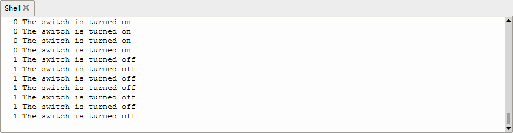

### Project 13: Hall Sensor

1.  **Description**

In this kit, there is a Hall sensor which mainly adopts a A3144 linear
Hall element. The element P1 is composed of a voltage regulator, a Hall
voltage generator, a differential amplifier, a Schmitt trigger, a
temperature compensation circuit and an open-collector output stage. In
the experiment, we use the Hall sensor to detect the magnetic field and
display the test results on the shell.

**2. Working Principle**

When the sensor detects no magnetic field or a north pole magnetic
field, the signal terminal will be high level; when it senses a south
pole magnetic field, the signal terminal will be low levels.

The stronger the magnetic field strength is, induction distance is
longer.

**3.Required Components**

<table>
<tbody>
<tr class="odd">
<td></td>
<td></td>
<td></td>
<td></td>
<td></td>
</tr>
<tr class="even">
<td>ESP32 Board*1</td>
<td>ESP32 Expansion Board*1</td>
<td>Keyestudio Hall Sensor*1</td>
<td>3P Dupont Wire*1</td>
<td>Micro USB Cable*1</td>
</tr>
</tbody>
</table>

**4.Wiring Diagram**

**5.Test Code：**

<table>
<tbody>
<tr class="odd">
<td>
from machine import Pin

import time

hall = Pin(15, Pin.IN)

while True:

value = hall.value()

print(value, end = " ")

if value == 0:

print("A magnetic field")

else:

print("There is no magnetic field")

time.sleep(0.1)
</td>
</tr>
</tbody>
</table>

**6. Test Result**

Wire up, power on and click “Run current script”,
the code starts executing, the string and the data will be displayed on
the Shell. when the sensor detects no magnetic fields or the north pole
magnetic field, Shell will show“1 There is no magnetic field”and the LED
on the sensor will be off; When it detects the south pole magnetic
field, the Shell will show“0 A magnetic field”and the LED on the sensor
will be on, as shown below. Press “Ctrl+C”or
click“Stop/Restart backend”to exit the program.

### Project 14: Reed Switch Module

1.  **Overview**

In this kit, there is a Keyestudio reed switch module, which mainly uses
a MKA10110 green reed component.

The reed switch is the abbreviation of the dry reed switch. It is a
passive electronic switch element with contacts.

It has the advantages of simple structure, small size and easy control.
Its shell is a sealed glass tube with two iron elastic reed electric
plates.

In the experiment, we will determine whether there is a magnetic field
near the module by reading the high and low level of the S terminal on
the module; and, we display the test result in the shell.

**2. Working Principle**

In normal conditions, the glass tube in the two reeds made of special
materials are separated. When a magnetic substance close to the glass
tube, in the role of the magnetic field lines, the pipe within the two
reeds are magnetized to attract each other in contact, the reed will
suck together, so that the junction point of the connected circuit
communication.

After the disappearance of the outer magnetic reed because of their
flexibility and separate, the line is disconnected. The sensor uses this
characteristic to build a circuit to convert magnetic field signal into
high and low level signal.  

**3.Required Components**

<table>
<tbody>
<tr class="odd">
<td></td>
<td></td>
<td></td>
<td></td>
<td></td>
</tr>
<tr class="even">
<td>ESP32 Board*1</td>
<td>ESP32 Expansion Board*1</td>
<td>Keyestudio Reed Switch Module*1</td>
<td>3P Dupont Wire*1</td>
<td>Micro USB Cable*1</td>
</tr>
</tbody>
</table>

**4.Wiring Diagram**

**5.Test Code：**

<table>
<tbody>
<tr class="odd">
<td>
from machine import Pin

import time

ReedSensor = Pin(15, Pin.IN)

while True:

value = ReedSensor.value()

print(value, end = " ")

if value == 0:

print("A magnetic field")

else:

print("There is no magnetic field")

time.sleep(0.1)
</td>
</tr>
</tbody>
</table>

**6. Test Result**

Wire up, power on and click “Run current script
and power on. When the sensor detects a magnetic field, val is 0 and the
red LED of the module lights up, "0 A magnetic field" will be displayed;
when no magnetic field is detected, val is 1, and the LED on the module
goes out, "1 There is no magnetic field" will be shown, as shown below.
Press “Ctrl+C” or click “Stop/Restart backend” to
exit the program.

### Project 15: PIR Motion Sensor

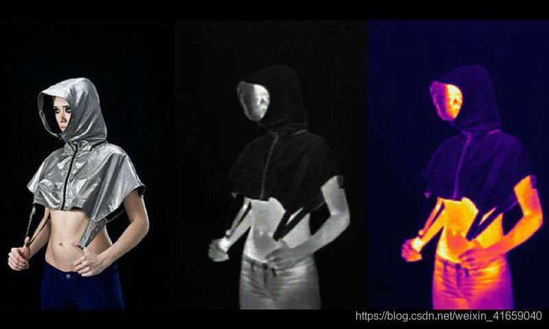

1.  **Overview**

In this kit, there is a Keyestudio PIR motion sensor, which mainly uses
an RE200B-P sensor elements. It is a human body pyroelectric motion
sensor based on pyroelectric effect, which can detect infrared rays
emitted by humans or animals, and the Fresnel lens can make the sensor's
detection range farther and wider.

In the experiment, we determine if there is someone moving nearby by
reading the high and low levels of the S terminal on the module. The
detected results will be displayed on the Shell.

**2. Working Principle**

The upper left part is voltage conversion(VCC to 3.3V). The working
voltage of sensors we use is 3.3V, therefore we can’t use 5V directly.
The voltage conversion circuit is needed.

When no person is detected or no infrared signal is received, and pin 1
of the sensor outputs low level. At this time, the LED on the module
will light up and the MOS tube Q1 will be connected and the signal
terminal S will detect Low levels.

When one is detected or an infrared signal is received, and pin 1 of the
sensor outputs a high level. Then LED on the module will go off, the MOS
tube Q1 is disconnected and the signal terminal S will detect high
levels.

2.  **Required Components**

<table>
<tbody>
<tr class="odd">
<td></td>
<td></td>
<td></td>
<td></td>
<td></td>
</tr>
<tr class="even">
<td>ESP32 Board*1</td>
<td>ESP32 Expansion Board*1</td>
<td>Keyestudio PIR Motion Sensor*1</td>
<td>3P Dupont Wire*1</td>
<td>Micro USB Cable*1</td>
</tr>
</tbody>
</table>

**4.Wiring Diagram**

**5.Test Code：**

<table>
<tbody>
<tr class="odd">
<td>
from machine import Pin

import time

PIR = Pin(15, Pin.IN)

while True:

value = PIR.value()

print(value, end = " ")

if value == 1:

print("Some body is in this area!")

else:

print("No one!")

time.sleep(0.1)
</td>
</tr>
</tbody>
</table>

**6. Test Result**

Wire up, power on and click “Run current script”,
the code starts executing, the string and the data will be displayed in
the ”Shell“ window. When the sensor detects someone nearby, value is 1,
the LED will go off and the ”Shell“ window will show“1 Somebody is in
this area\!”. On the contrary, the value is 0, the LED will go up and“0
No one\!”will be shown, as shown below. Press “Ctrl+C”or
click“Stop/Restart backend” to exit the program.

### Project 16: Active Buzzer

1.  **Overview**

In this kit, it contains an active buzzer module and a power amplifier
module (the principle is equivalent to a passive buzzer). In this
experiment, we control the active buzzer to emit sounds. Since it has
its own oscillating circuit, the buzzer will automatically sound if
given large voltage.

**2. Working Principle**

From the schematic diagram, the pin of buzzer is connected to a resistor
R2 and another port is linked with a NPN triode Q1. So, if this triode
Q1 is powered, the buzzer will sound.

If the base electrode of the triode connected to the R1 resistor is a
high level, the triode Q1 will be connected.If the base electrode is
pulled down by the resistor R3, the triode is disconnected.

When we output a high level from the IO port to the triode, the buzzer
will emit sounds; if outputting low levels, the buzzer won’t emit
sounds.

**3.Required Components**

<table>
<tbody>
<tr class="odd">
<td></td>
<td></td>
<td></td>
<td></td>
<td></td>
</tr>
<tr class="even">
<td>ESP32 Board*1</td>
<td>ESP32 Expansion Board*1</td>
<td>Keyestudio Active Buzzer*1</td>
<td>3P Dupont Wire*1</td>
<td>Micro USB Cable*1</td>
</tr>
</tbody>
</table>

**4.Wiring Diagram**

**5.Test Code：**

<table>
<tbody>
<tr class="odd">
<td>
from machine import Pin

import time

buzzer = Pin(15, Pin.OUT)

while True:

buzzer.value(1)

time.sleep(1)

buzzer.value(0)

time.sleep(1)
</td>
</tr>
</tbody>
</table>

**6. Code Explanation**

In the experiment, we set the pin to GPIO15. When setting to high, the
active buzzer will beep; when setting to low, the active buzzer will
stop emitting sounds.

**7. Test Result**

Wire up and power on. Click “Run current script”,
the code starts executing. The active buzzer will emit sound for 1
second, and stop for 1 second. Press “Ctrl+C” or click
“Stop/Restart backend” to exit the program.

### Project 17: 8002b Audio Power Amplifier

1.  **Overview**

In this kit, there is a Keyestudio 8002b audio power amplifier. The main
components of this module are an adjustable potentiometer, a speaker,
and an audio amplifier chip;

The main function of this module is: it can amplify the output audio
signal, with a magnification of 8.5 times, and play sound or music
through the built-in low-power speaker, as an external amplifying device
for some music playing equipment.

In the experiment, we used the 8002b power amplifier speaker module to
emit sounds of various frequencies.

**2. Working Principle**

In fact, it is similar to a passive buzzer. The active buzzer has its
own oscillation source.Yet, the passive buzzer does not have internal
oscillation. When controlling the circuit, we need to input square waves
of different frequencies to the positive pole of the component and
ground the negative pole to control the buzzer to chime sounds of
different frequencies.

**3.Required Components**

<table>
<tbody>
<tr class="odd">
<td></td>
<td></td>
<td></td>
<td></td>
<td></td>
</tr>
<tr class="even">
<td>ESP32 Board*1</td>
<td>ESP32 Expansion Board*1</td>
<td>Keyestudio 8002b Audio Power Amplifier*1</td>
<td>3P Dupont Wire*1</td>
<td>Micro USB Cable*1</td>
</tr>
</tbody>
</table>

**4.Wiring Diagram**

**5.Test Code：**

<table>
<tbody>
<tr class="odd">
<td>
from machine import Pin, PWM

from time import sleep

buzzer = PWM(Pin(15))

buzzer.duty(1000)

buzzer.freq(523)#DO

sleep(0.5)

buzzer.freq(586)#RE

sleep(0.5)

buzzer.freq(658)#MI

sleep(0.5)

buzzer.freq(697)#FA

sleep(0.5)

buzzer.freq(783)#SO

sleep(0.5)

buzzer.freq(879)#LA

sleep(0.5)

buzzer.freq(987)#SI

sleep(0.5)

buzzer.duty(0)
</td>
</tr>
</tbody>
</table>

**6. Code Explanation**

1\. In this experiment, we use the PWM class of the machine module,
buzzer = PWM(Pin(15)) to create an instance of the PWM class, and the
buzzer pin is connected to GPIO15.

The buzzer.duty(1000): set the duty cycle, and the duty cycle is
1000/4095. The larger the value, the louder the buzzer. When set to 0,
the buzzer does not emit sound. **buzzer.freq()** is the frequency
setting method.

In the experiment, we use the PWM on the machine module. **buzzer =
PWM(Pin(15))**

**7. Test Result**

Wire up and power on. Click “Run current script”,
the code starts executing. The power amplifier module will emit the
sound of the corresponding frequency corresponding to the beat :DO for
0.5s, Re for 0.5s, Mi for 0.5s, Fa for 0.5s, So for 0.5s, La 0.5s and Si
for 0.5s. Press “Ctrl+C”or click“Stop/Restart
backend”to exit the program.

### Project 18: 130 Motor

1.  **Description**

The 130 motor driver module is compatible with servo motors, which has
high efficiency and good quality fans.

It adopts a HR1124S motor control chip. HR1124S is a single-channel
H-bridge driver chip for DC motor solutions. In addition, this chip has
low standby current and low quiescent current.

The module is compatible with various single-chip control boards. In the
experiment, we can control the rotation direction of the motor by
outputting the voltage directions of the two signal terminals IN+ and
IN- to make the motor rotate.

**2. Working Principle**

The chip is used to help drive the motor. We can’t drive it with a
triode or an IO port due to its a large current of need. It is very
simple to make the motor rotate. Just apply voltage to both ends of the
motor. The direction of the motor is different in different voltage
directions. Within the rated voltage, the higher the voltage, the faster
the motor rotates; on the contrary, the lower the voltage, the slower
the motor rotates, or even unable to rotate.

So we can use the PWM port to control the speed of the motor. We haven't
learned PWM here, so we use the high and low levels to control the motor
first.

**3.Required Components**

<table>
<tbody>
<tr class="odd">
<td></td>
<td></td>
<td></td>
<td></td>
</tr>
<tr class="even">
<td>ESP32 Board*1</td>
<td>ESP32 Expansion Board*1</td>
<td>Keyestudio 130 Motor*1</td>
<td>4P Dupont Wire*1</td>
</tr>
<tr class="odd">
<td></td>
<td></td>
<td></td>
<td></td>
</tr>
<tr class="even">
<td>Micro USB Cable*1</td>
<td>6 AA Battery Holder*1</td>
<td>Battery (not included)*6</td>
<td></td>
</tr>
</tbody>
</table>

Note: the motor is separated with its fan, you need to assemble it
first.

**4. Connection Diagram**

<table>
<tbody>
<tr class="odd">
<td>130 Motor</td>
<td>ESP32 Expansion Board</td>
</tr>
<tr class="even">
<td>G</td>
<td>G</td>
</tr>
<tr class="odd">
<td>V</td>
<td>5V</td>
</tr>
<tr class="even">
<td>IN+</td>
<td>IO15</td>
</tr>
<tr class="odd">
<td>IN-</td>
<td>IO4</td>
</tr>
</tbody>
</table>

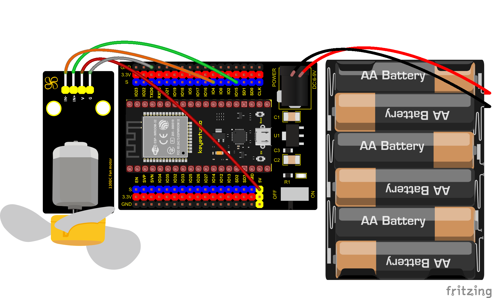

**5.Test Code：**

<table>
<tbody>
<tr class="odd">
<td>
from machine import Pin

import time

#Two pins of the motor

INA = Pin(15, Pin.OUT) #INA corresponds to IN+

INB = Pin(4, Pin.OUT)#INB corresponds to IN-

while True:

#Counterclockwise 2s

INA.value(1)

INB.value(0)

time.sleep(2)

#stop 1s

INA.value(0)

INB.value(0)

time.sleep(1)

#Turn clockwise for 2s

INA.value(0)

INB.value(1)

time.sleep(2)

#stop 1s

INA.value(0)

INB.value(0)

time.sleep(1)
</td>
</tr>
</tbody>
</table>

**6. Code Explanation**

Set pins to GPIO4, GPIO15, when the pin GPIO4 outputs low levels and the
pin GPIO15 outputs high levels, the motor will rotate counterclockwise;
when both pins are set to low, the motor stops rotating.

**7. Test Result**

Wire up, power on and click . Turn the DIP switch
to ON , after powering on, click “Run current
script”, the code starts executing. the fan will rotate counterclockwise
for 2 seconds, stop for 1 second; and rotate clockwise for 2 seconds and
stop for 1 second; cycle alternately. Press “Ctrl+C”or
click“Stop/Restart backend”to exit the program.

### Project 19: Potentiometer

1.  **Overview**

The following we will introduce is the Keyestudio rotary potentiometer
which is an analog sensor.

The digital IO ports can read the voltage value between 0 and 3.3V and
the module only outputs high levels. However, the analog sensor can read
the voltage value through 16 ADC analog ports on the ESP32 board. In the
experiment, we will display the test results on the Shell.

**2. Working Principle**

It uses a 10K adjustable resistor. We can change the resistance by
rotating the potentiometer. The signal S can detect the voltage
changes(0-3.3V) which are analog quantity.

**ADC：**The more bits an ADC has, the denser the partitioning of the
simulation, the higher the accuracy of the final conversion.

The conversion formula is as follows:

**DAC：**The higher the precision of DAC, the higher the precision of the
output voltage value.  

The conversion formula is as follows:  

**ADC on ESP32：**

The ESP32 has 16 pins that can be used to measure analog signals. GPIO
pin serial numbers and analog pin definitions are shown below:  

<table>
<tbody>
<tr class="odd">
<td>ADC number in ESP32</td>
<td>ESP32 GPIO number</td>
</tr>
<tr class="even">
<td>ADC0</td>
<td>GPIO 36</td>
</tr>
<tr class="odd">
<td>ADC3</td>
<td>GPIO 39</td>
</tr>
<tr class="even">
<td>ADC4</td>
<td>GPIO 32</td>
</tr>
<tr class="odd">
<td>ADC5</td>
<td>GPIO33</td>
</tr>
<tr class="even">
<td>ADC6</td>
<td>GPIO34</td>
</tr>
<tr class="odd">
<td>ADC7</td>
<td>GPIO 35</td>
</tr>
<tr class="even">
<td>ADC10</td>
<td>GPIO 4</td>
</tr>
<tr class="odd">
<td>ADC11</td>
<td>GPIO0</td>
</tr>
<tr class="even">
<td>ADC12</td>
<td>GPIO2</td>
</tr>
<tr class="odd">
<td>ADC13</td>
<td>GPIO15</td>
</tr>
<tr class="even">
<td>ADC14</td>
<td>GPIO13</td>
</tr>
<tr class="odd">
<td>ADC15</td>
<td>GPIO 12</td>
</tr>
<tr class="even">
<td>ADC16</td>
<td>GPIO 14</td>
</tr>
<tr class="odd">
<td>ADC17</td>
<td>GPIO27</td>
</tr>
<tr class="even">
<td>ADC18</td>
<td>GPIO25</td>
</tr>
<tr class="odd">
<td>ADC19</td>
<td>GPIO26</td>
</tr>
</tbody>
</table>

**DAC on ESP32：**

The ESP32 has two 8-bit digital-to-analog converters connected to GPIO25
and GPIO26 pins, which are immutable, as shown below :

<table>
<tbody>
<tr class="odd">
<td>Simulate pin number</td>
<td>GPIO number</td>
</tr>
<tr class="even">
<td>DAC1</td>
<td>GPIO25</td>
</tr>
<tr class="odd">
<td>DAC2</td>
<td>GPIO26</td>
</tr>
</tbody>
</table>

**3.Required Components**

<table>
<tbody>
<tr class="odd">
<td></td>
<td></td>
<td></td>
<td></td>
<td></td>
</tr>
<tr class="even">
<td>ESP32 Board*1</td>
<td>ESP32 Expansion Board*1</td>
<td>Keyestudio Rotary Potentiometer*1</td>
<td>3P Dupont Wire*1</td>
<td>Micro USB Cable*1</td>
</tr>
</tbody>
</table>

**4.Wiring Diagram**

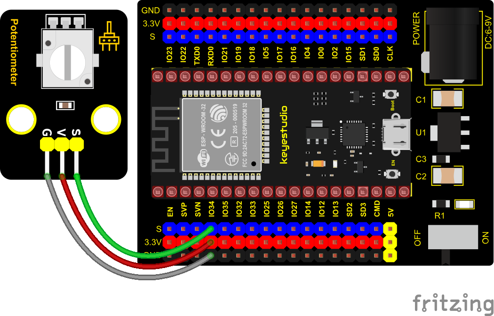

**5.Test Code：**

<table>
<tbody>
<tr class="odd">
<td>
# Import Pin, ADC and DAC modules.

from machine import ADC,Pin,DAC

import time

# Turn on and configure the ADC with the range of 0-3.3V

adc=ADC(Pin(34))

adc.atten(ADC.ATTN_11DB)

adc.width(ADC.WIDTH_12BIT)

# Read ADC value once every 0.1seconds, convert ADC value to DAC value and output it,

# and print these data to “Shell”.

try:

while True:

adcVal=adc.read()

dacVal=adcVal//16

voltage = adcVal / 4095.0 * 3.3

print("ADC Val:",adcVal,"DACVal:",dacVal,"Voltage:",voltage,"V")

time.sleep(0.1)

except:

pass
</td>
</tr>
</tbody>
</table>

**6. Code Explanation**

1\. In the experiment, add "From Machine import ADC" to the top of your
Python file every time you use the ACD module, the same goes for DAC
modules. 

2\. machine.ADC(pin):Create an ADC object associated with the given pin.
pin:：The available pins are
Pin(36)、Pin(39)、Pin(34）、Pin(35)、Pin(32)、Pin(33). DAC(pin):
Create an DAC object associated with the given pin. Pin：The available
pins are pin (25) 、pin (26).

3.ADC. Read():Read ADC value and return ADC value.  

4\.**ADC.atten(db)**: Set attenuation ration (that is, the full range
voltage, such as the voltage of 11db full range is 3.3V)

**db**：attenuation ratio

**ADC.ATTIN\_0DB** —full range of 1.2V

**ADC.ATTN\_2\_5\_DB** —full range of 1.5V

**ADC.ATTN\_6DB** —full range of 2.0 V

**ADC.ATTN\_11DB** —full range of 3.3V

**ADC.width(bit)**: Set data width.

**bit**：data bit

**ADC.WIDTH\_9BIT** —9 data width

**ADC.WIDTH\_10BIT** — 10 data width

**ADC.WIDTH\_11BIT** — 11 data width

**ADC.WIDTH\_12BIT** — 12 data width

**5. The read()method reads the** ADCvalue，rang is 0\~4095，the
**adc.read()** reads the ADC value input by the ADC(Pin(36)) Pin and
assigns it to a variable named adcVal.  

6\. DAC.write(value):Output the voltage value, the data rang : 0-255，the
corresponding output voltage is 0-3.3V.

**7. Test Result**

Wire up and power on. Click “Run current script”,
the code starts executing. The "Shell" window prints and displays the
potentiometer ADC value, DAC value and voltage value.

Rotating the potentiometer handle, the ADC value, DAC value and voltage
value will change. Press“Ctrl+C”or
click“Stop/Restart backend”to exit the program.

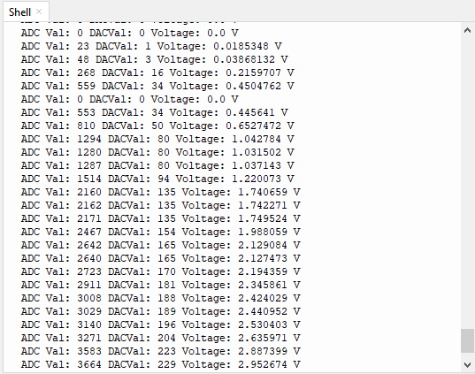

### Project 20: Steam Sensor

1.  **Description**

This is a DIY electronic building block water drop sensor. It is an
analog (digital) input module, also called rain, rain sensor. It can be
used to monitor various weather conditions, detect whether it is raining
and the amount of rain, convert it into digital signal (DO) and analog
signal (AO) output, and is widely used in Arduino robot kits, raindrops,
rain sensors, and can be used for various It can monitor various weather
conditions, and convert it into digital signal and AO output, and can
also be used for automobile automatic wiper system, intelligent lighting
system and intelligent sunroof system.

In the experiment, we input the sensor signal terminal (S terminal) to
the analog port of the ESP32 development board, sense the change of the
analog value, and display the corresponding analog value on the shell.

**2. Working Principle**

Its principle is to detect the amount of water through the exposed
printed parallel lines on the circuit board. The more water there is,
the more wires will be connected, and the conductive contact area
increases. The voltage output by pin 2 will gradually increase. The
larger the analog value detected by the signal terminal S is.

It can also detect steam in the air. Two position holes are used to
install on the other devices.

**3.Required Components**

<table>
<tbody>
<tr class="odd">
<td></td>
<td></td>
<td></td>
<td></td>
<td></td>
</tr>
<tr class="even">
<td>ESP32 Board*1</td>
<td>ESP32 Expansion Board*1</td>
<td>Keyestudio DIY Steam Sensor *1</td>
<td>3P Dupont Wire*1</td>
<td>Micro USB Cable*1</td>
</tr>
</tbody>
</table>

**4.Wiring Diagram**

**5.Test Code：**

<table>
<tbody>
<tr class="odd">
<td>
# Import Pin, ADC and DAC modules.

from machine import ADC,Pin,DAC

import time

# Turn on and configure the ADC with the range of 0-3.3V

adc=ADC(Pin(34))

adc.atten(ADC.ATTN_11DB)

adc.width(ADC.WIDTH_12BIT)

# Read ADC value once every 0.1seconds, convert ADC value to DAC value and output it,

# and print these data to “Shell”.

try:

while True:

adcVal=adc.read()

dacVal=adcVal//16

voltage = adcVal / 4095.0 * 3.3

print("ADC Val:",adcVal,"DACVal:",dacVal,"Voltage:",voltage,"V")

time.sleep(0.1)

except:

pass
</td>
</tr>
</tbody>
</table>

**6. Test Result**

Wire up, power on and click “Run current script”,
the code starts executing. The Shell will display ADC value, DAC value
and voltage value of the sensor. When a few drops of water are placed in
the sensor sensing area, the ADC value, DAC value and voltage value will
change. The more water volume, the greater the output voltage value ,
ADC value and the DAC value. Press“Ctrl+C”or
click“Stop/Restart backend”to exit the program.

### Project 21: Sound Sensor

1.  **Overview**

In this kit, there is a Keyestudio DIY electronic block and a sound
sensor. In the experiment, we test the analog value corresponding to the
sound level in the current environment with it. The louder the sound,
the larger the ADC, DAC and the voltage value, and the “shell”window
will display the test results.

**2. Working Principle**

It uses a high-sensitive microphone component and an LM386 chip. We
build the circuit with the LM386 chip and amplify the sound through the
high-sensitive microphone. In addition, we can adjust the sound volume
by the potentiometer. Rotate it clockwise, the sound will get louder.

**3.Required Components**

<table>
<tbody>
<tr class="odd">
<td></td>
<td></td>
<td></td>
<td></td>
<td></td>
</tr>
<tr class="even">
<td>ESP32 Board*1</td>
<td>ESP32 Expansion Board*1</td>
<td>Keyestudio Sound Sensor*1</td>
<td>3P Dupont Wire*1</td>
<td>Micro USB Cable*1</td>
</tr>
</tbody>
</table>

**4.Wiring Diagram**

**5.Test Code：**

<table>
<tbody>
<tr class="odd">
<td>
# Import Pin, ADC and DAC modules.

from machine import ADC,Pin,DAC

import time

# Turn on and configure the ADC with the range of 0-3.3V

adc=ADC(Pin(34))

adc.atten(ADC.ATTN_11DB)

adc.width(ADC.WIDTH_12BIT)

# Read ADC value once every 0.1seconds, convert ADC value to DAC value and output it,

# and print these data to “Shell”.

try:

while True:

adcVal=adc.read()

dacVal=adcVal//16

voltage = adcVal / 4095.0 * 3.3

print("ADC Val:",adcVal,"DACVal:",dacVal,"Voltage:",voltage,"V")

time.sleep(0.1)

except:

pass
</td>
</tr>
</tbody>
</table>

**6. Test Result**

Wire up, power on and click “Run current script”,
the code starts executing. The "Shell" window will display the sound
sensor ADC value, DAC value and voltage value. Rotate the potentiometer
clockwise and speak at the MIC. Then you can see the analog value get
larger, as shown below. Press“Ctrl+C”or
click“Stop/Restart backend”to exit the program.

### Project 22: Photoresistor

1.  **Description**

In this kit, there is a photoresistor which consists of photosensitive
resistance elements. Its resistance changes with the light intensity.
Also, it converts the resistance change into a voltage change through
the characteristic of the photosensitive resistive element. When wiring
it up, we interface its signal terminal (S terminal) with the analog
port of ESP32 , so as to sense the change of the analog value, and
display the corresponding analog value in the shell.

**2. Working Principle**

If there is no light, the resistance is 0.2MΩ and the detected voltage
at the terminal 2 is close to 0. When the light intensity increases, the
resistance of photoresistor and detected voltage will diminish.

**3. Required Components**

<table>
<tbody>
<tr class="odd">
<td></td>
<td></td>
<td></td>
<td></td>
<td></td>
</tr>
<tr class="even">
<td>ESP32 Board*1</td>
<td>ESP32 Expansion Board*1</td>
<td>Keyestudio DIY Photoresistor*1</td>
<td>3P Dupont Wire*1</td>
<td>Micro USB Cable*1</td>
</tr>
</tbody>
</table>

**4.Wiring Diagram**

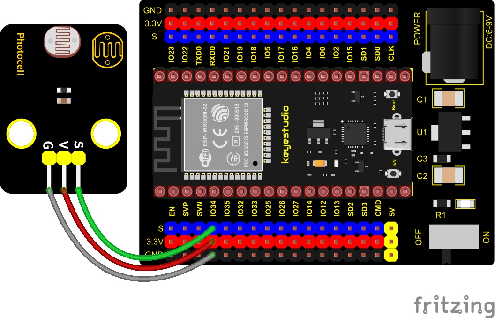

**5.Test Code：**

<table>
<tbody>
<tr class="odd">
<td>
# Import Pin, ADC and DAC modules.

from machine import ADC,Pin,DAC

import time

# Turn on and configure the ADC with the range of 0-3.3V

adc=ADC(Pin(34))

adc.atten(ADC.ATTN_11DB)

adc.width(ADC.WIDTH_12BIT)

# Read ADC value once every 0.1seconds, convert ADC value to DAC value and output it,

# and print these data to “Shell”.

try:

while True:

adcVal=adc.read()

dacVal=adcVal//16

voltage = adcVal / 4095.0 * 3.3

print("ADC Val:",adcVal,"DACVal:",dacVal,"Voltage:",voltage,"V")

time.sleep(0.1)

except:

pass
</td>
</tr>
</tbody>
</table>

**6. Test Result**

Wire up, power on and click “Run current script”,
the code starts executing. The "Shell" window will display the
photoresistor ADC value, DAC value and voltage value. The brighter the
light, the greater the analog value, as shown below. Press“Ctrl+C”or
click“Stop/Restart backend”to exit the program.

### Project 23: NTC-MF52AT Thermistor

1.  **Overview**

In the experiment, there is a NTC-MF52AT analog thermistor. We connect
its signal terminal to the analog port of the ESP32 mainboard and read
the corresponding ADC value, voltage value and thermistor value.

We can use analog values to calculate the temperature of the current
environment through specific formulas. Since the temperature calculation
formula is more complicated, we only read the corresponding analog
value.

**2. Working Principle**

NTC-MF52AT thermistor elements. The NTC-MF52AT thermistor element can
sense the changes of the surrounding environment temperature. Resistance
changes with the temperature, causing the voltage of the signal terminal
S to change.

This sensor uses the characteristics of NTC-MF52AT thermistor element to
convert resistance changes into voltage changes.

**3.Required Components**

<table>
<tbody>
<tr class="odd">
<td></td>
<td></td>
<td></td>
<td></td>
<td></td>
</tr>
<tr class="even">
<td>ESP32 Board*1</td>
<td>ESP32 Expansion Board*1</td>
<td>Keyestudio NTC-MF52AT Thermistor*1</td>
<td>3P Dupont Wire*1</td>
<td>Micro USB Cable*1</td>
</tr>
</tbody>
</table>

**4.Wiring Diagram**

**5.Test Code：**

<table>
<tbody>
<tr class="odd">
<td>
from machine import Pin, ADC

import time

import math

#Set ADC

adc=ADC(Pin(34))

adc.atten(ADC.ATTN_11DB)

adc.width(ADC.WIDTH_12BIT)

try:

while True:

adcValue = adc.read()

voltage = adcValue / 4095 * 3.3

Rt = 10 * voltage / (3.3-voltage)

tempK = (1 / (1 / (273.15+25) + (math.log(Rt/4.7)) / 3950))

tempC = (tempK - 273.15)

print("ADC value:",adcValue," Voltage:",voltage,"V"," Temperature: ",tempC,"C");

time.sleep(1)

except:

pass
</td>
</tr>
</tbody>
</table>

**6. Test Result**

Wire up and power on. Click “Run current script”,
the code starts executing. The "Shell" window will display the
thermistor ADC value, voltage value and temperature value, as shown
below. Press“Ctrl+C”or click“Stop/Restart
backend”to exit the program.

### Project 24: Thin-film Pressure Sensor

1.  **Overview**

In this kit, there is a Keyestudio thin-film pressure sensor. The
thin-film pressure sensor composed of a new type of Nano
pressure-sensitive material and a comfortable ultra-thin film substrate,
has waterproof and pressure-sensitive functions.

In the experiment, we determine the pressure by collecting the analog
signal on the S end of the module. The smaller the ADC value, DAC value
and voltage value, the greater the pressure; and the displayed results
will shown on the Shell.

**3.Required Components**

<table>
<tbody>
<tr class="odd">
<td></td>
<td></td>
<td></td>
<td></td>
<td></td>
</tr>
<tr class="even">
<td>ESP32 Board*1</td>
<td>ESP32 Expansion Board*1</td>
<td>Keyestudio Thin-film Pressure Sensor*1</td>
<td>3P Dupont Wire*1</td>
<td>Micro USB Cable*1</td>
</tr>
</tbody>
</table>

**4.Wiring Diagram**

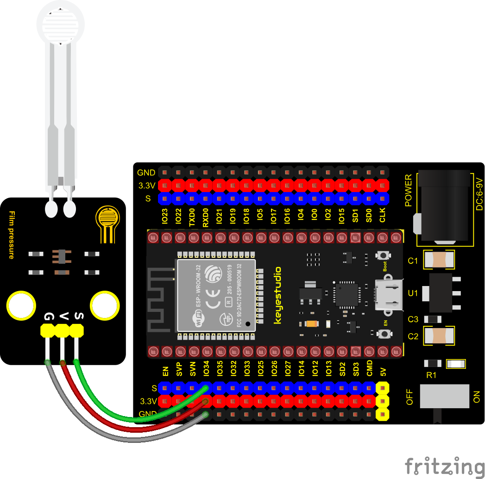

**5.Test Code：**

<table>
<tbody>
<tr class="odd">
<td>
# Import Pin, ADC and DAC modules.

from machine import ADC,Pin,DAC

import time

# Turn on and configure the ADC with the range of 0-3.3V

adc=ADC(Pin(34))

adc.atten(ADC.ATTN_11DB)

adc.width(ADC.WIDTH_12BIT)

# Read ADC value once every 0.1seconds, convert ADC value to DAC value and output it,

# and print these data to “Shell”.

try:

while True:

adcVal=adc.read()

dacVal=adcVal//16

voltage = adcVal / 4095.0 * 3.3

print("ADC Val:",adcVal,"DACVal:",dacVal,"Voltage:",voltage,"V")

time.sleep(0.1)

except:

pass
</td>
</tr>
</tbody>
</table>

**6. Test Result**

Wire up and power on. Click “Run current script”,
the code starts executing. The "Shell" window will display the Thin-film
Pressure Sensor ADC value, voltage value and DAC value. When the
thin-film is pressed by fingers, the analog value will decrease, as
shown below. Press “Ctrl+C”or click “Stop/Restart
backend” to exit the program.

### Project 25: Flame Sensor

1.  **Description**

In daily life, it is often seen that a fire broke out without any
precaution. It will cause great economic and human loss. So how can we
avoid this situation? Right, install a flame sensor and a speaker in
those places that easily break out a fire. When the flame sensor detects
a fire, the speaker will alarm people quickly to put out the fire.

So in this project, you will learn how to use a flame sensor and an
active buzzer module to simulate the fire alarm system.

**2. Working Principle**

This flame sensor can be used to detect fire or other light sources with
wavelength stands at 700nm \~ 1000nm. Its detection angle is about 60°.
You can rotate the potentiometer on the sensor to control its
sensitivity. Adjust the potentiometer to make the LED at the critical
point between on and off state. The sensitivity is the best.

From the below figure, power up. When detecting fire, the digital pin
outputs low levels, the red LED2 will light up first, the digital signal
terminal D0 outputs a low level, and the red LED1 will light up. The
stronger the external infrared light, the smaller the value; the weaker
the infrared light, the larger the value.

**3.Required Components**

<table>
<tbody>
<tr class="odd">
<td></td>
<td></td>
<td></td>
<td></td>
<td></td>
</tr>
<tr class="even">
<td>ESP32 Board*1</td>
<td>ESP32 Expansion Board*1</td>
<td>keyestudio Flame Sensor*1</td>
<td>4P Dupont Wire*1</td>
<td>Micro USB Cable*1</td>
</tr>
</tbody>
</table>

**4.Wiring Diagram**

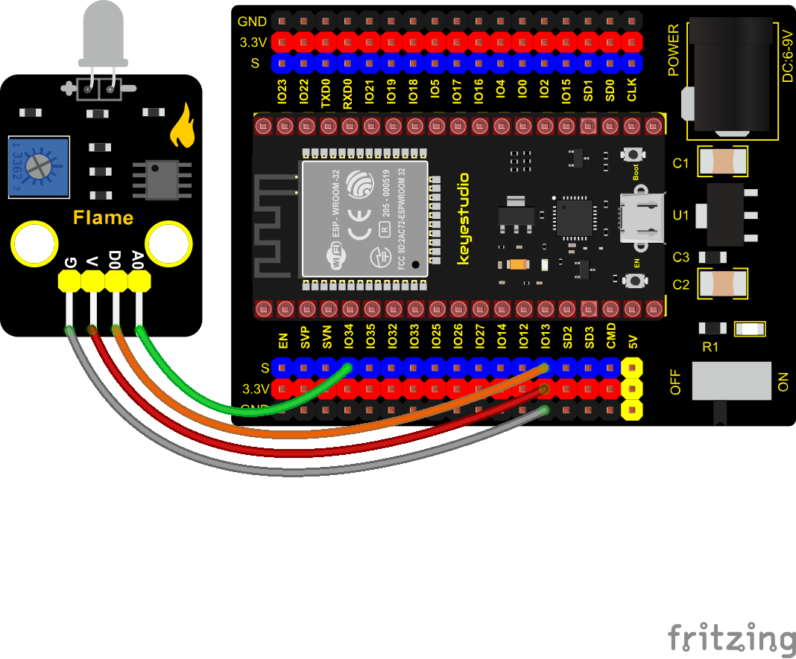

**5.Test Code：**

<table>
<tbody>
<tr class="odd">
<td>
# Import Pin, ADC and DAC modules.

from machine import ADC,Pin,DAC

import time

flame_D = Pin(13, Pin.IN)

# Turn on and configure the ADC with the range of 0-3.3V

adc=ADC(Pin(34))

adc.atten(ADC.ATTN_11DB)

adc.width(ADC.WIDTH_12BIT)

# Read digital value and ADC value once every 0.1seconds, convert ADC value to DAC value and Voltage value and output it,

# and print these data to “Shell”.

try:

while True:

digitalVal = flame_D.value()

adcVal=adc.read()

dacVal=adcVal//16

voltage = adcVal / 4095.0 * 3.3

print("digitalVal:",digitalVal,"ADC Val:",adcVal,"DACVal:",dacVal,"Voltage:",voltage,"V")

time.sleep(0.1)

except:

pass
</td>
</tr>
</tbody>
</table>

**6. Code Explanation**

Two pins we use are defined as GPIO13 and GPIO34 according to the
wiring-up diagram, and print digital signals and analog signals
respectively.

**7. Test Result**

Wire up, power on and click “Run current script”,
the code starts executing. After powering on, rotating the potentiometer
on the sensor, we can adjust the red LED bright and not bright critical
point. The red LED2 on the sensor module is lit, while the red LED1 is
not. The Shell will print and display the digital value, ADC value, DAC
value and voltage value of the flame sensor. When fire is detected, the
LED1 will be on. the digital value will change from 1 to 0, and the
analog value will become smaller, as shown below. Press “Ctrl+C”or click
“Stop/Restart backend” to exit the program.

### Project 26: MQ-2 Gas Sensor

1.  **Description**

This analog gas sensor - MQ2 is used in gas leakage detecting equipment
in consumer electronics and industrial markets.

This sensor is suitable for detecting LPG, I-butane, propane, methane,
alcohol, Hydrogen and smoke. It has high sensitivity and quick response.

In addition, the sensitivity can be adjusted by rotating the
potentiometer.

In the experiment, we read the analog value at the A0 port and the D0
port to determine the content of gas.

**2. Working Principle**

The greater the concentration of smoke, the greater the conductivity,
the lower the output resistance, the greater the output analog signal.

When in use, the A0 terminal reads the analog value of the corresponding
gas; the D0 terminal is connected to an LM393 chip (voltage comparator),
we can adjust the alarm threshold of the measured gas through the
potentiometer, and output the digital value at D0. When the measured gas
content exceeds the critical point, the D0 terminal outputs a low level;
when the measured gas content does not exceed the critical point, the D0
terminal outputs a high level.

**3.Required Components**

<table>
<tbody>
<tr class="odd">
<td></td>
<td></td>
<td></td>
<td></td>
<td></td>
</tr>
<tr class="even">
<td>ESP32 Board*1</td>
<td>ESP32 Expansion Board*1</td>
<td>keyestudio DIY Analog Gas Sensor*1</td>
<td>4P Dupont Wire*1</td>
<td>Micro USB Cable*1</td>
</tr>
</tbody>
</table>

**4.Wiring Diagram**

**5. Test Code：**

<table>
<tbody>
<tr class="odd">
<td>
# Import Pin, ADC and DAC modules.

from machine import ADC,Pin,DAC

import time

# Turn on and configure the ADC with the range of 0-3.3V

mq2_D = Pin(13, Pin.IN)

adc=ADC(Pin(34))

adc.atten(ADC.ATTN_11DB)

adc.width(ADC.WIDTH_12BIT)

# Read digital value and ADC value once every 0.1seconds, convert ADC value to DAC value and Voltage value and output it,

# and print these data to “Shell”.

while True:

digitalVal = mq2_D.value()

adcVal=adc.read()

dacVal=adcVal//16

voltage = adcVal / 4095.0 * 3.3

print("digitalVal:",digitalVal,"ADC Val:",adcVal,"DACVal:",dacVal,"Voltage:",voltage,"V", end = " ")

if digitalVal == 0:

print("Exceeding")

else:

print("Normal")

time.sleep(0.1)
</td>
</tr>
</tbody>
</table>

**6. Test Result**

Wire up, power on and click “Run current script”,
the code starts executing.The shell will display the corresponding data
and string. After powering on, by rotating the potentiometer on the
sensor, we can adjust the red LED bright and not bright critical point.
When the sensor detects the smoke or combustible gas, the red LED lights
up and the digital value in the Shell changes from 1 to 0, the ADC
value, DAC value and voltage value increase, as shown below. Press
“Ctrl+C”or click “Stop/Restart backend” to exit
the program.

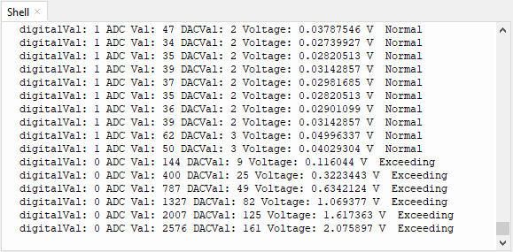

### Project 27: Joystick Module

**1. Overview**

Game handle controllers are ubiquitous.

It mainly uses PS2 joysticks. When controlling it, we need to connect
the X and Y ports of the module to the analog port of the single-chip
microcomputer, port B to the digital port of the single-chip
microcomputer, VCC to the power output port(3.3-5V), and GND to the GND
of the MCU. We can read the high and low levels of two analog values and
one digital port) to determine the working status of the joystick on the
module.

In the experiment, two analog values(x axis and y axis) will be shown on
Shell.

**2. Working Principle**

In fact, its working principle is very simple. Its inside structure is
equivalent to two adjustable potentiometers and a button. When this
button is not pressed and the module is pulled down by R1, low levels
will be output ; on the contrary, when the button is pressed, VCC will
be connected (high levels), When we move the joystick, the internal
potentiometer will adjust to output different voltages, and we can read
the analog value.

**3.Required Components**

<table>
<tbody>
<tr class="odd">
<td></td>
<td></td>
<td></td>
<td></td>
<td></td>
</tr>
<tr class="even">
<td>ESP32 Board*1</td>
<td>ESP32 Expansion Board*1</td>
<td>Keyestudio Joystick Module*1</td>
<td>5P Dupont Wire*1</td>
<td>Micro USB Cable*1</td>
</tr>
</tbody>
</table>

**4.Wiring Diagram**

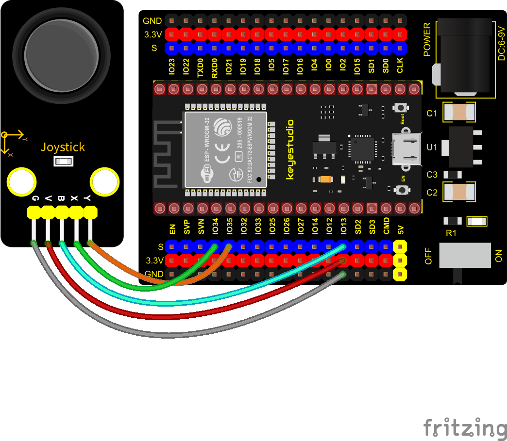

**5.Test Code：**

<table>
<tbody>
<tr class="odd">
<td>
from machine import Pin, ADC

import time

# Initialize the joystick module (ADC function)

rocker_x=ADC(Pin(34))

rocker_y=ADC(Pin(35))

button_z=Pin(13,Pin.IN,Pin.PULL_UP)

# Set the acquisition range of voltage of the two ADC channels to 0-3.3V,

# and the acquisition width of data to 0-4095.

rocker_x.atten(ADC.ATTN_11DB)

rocker_y.atten(ADC.ATTN_11DB)

rocker_x.width(ADC.WIDTH_12BIT)

rocker_y.width(ADC.WIDTH_12BIT)

# In the code, configure Z_Pin to pull-up input mode.

# In loop(), use Read () to read the value of axes X and Y

# and use value() to read the value of axis Z, and then display them.

while True:

print("X,Y,Z:",rocker_x.read(),",",rocker_y.read(),",",button_z.value())

time.sleep(0.5)
</td>
</tr>
</tbody>
</table>

**6. Code Explanation**

In the experiment, according to the wiring diagram, the x pin is set to
GPIO34, the y pin is set to GPIO35 and the pin of the joystick is set to
GPIO13.

**7. Test Result**

Wire up, power on and click “Run current script”,
the code starts executing. The "Shell" window will print the analog and
digital values of the current joystick. Moving the joystick will change
the analog and digital values in "Shell". Press“Ctrl+C”or
click“Stop/Restart backend”to exit the program.

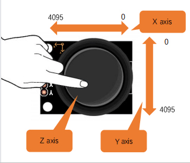

### Project 28: Relay Module

1.  **Overview**

In our daily life, we usually use communication to drive electrical
equipments, and sometimes we use switches to control electrical
equipments. If the switch is connected directly to the ac circuit,
leakage occurs and people are in danger. Therefore, from the perspective
of safety, we specially designed this relay module with NO(normally
open) end and NC(normally closed) end.  

**2. Working Principle**

Relay is compatible with a variety of microcontroller control board,
such as Arduino series microcontroller, which is a small current to
control the operation of large current "automatic switch".  

Input Voltage：3.3V-5V

It can let the MCU control board drive 3A load, such as an LED lamp
belt, a DC motor, a micro water pump and a solenoid valve plugable
interface design, which is easy to use.  

**3.Required Components**

<table>
<tbody>
<tr class="odd">
<td></td>
<td></td>
<td></td>
<td></td>
<td></td>
</tr>
<tr class="even">
<td>ESP32 Board*1</td>
<td>ESP32 Expansion Board*1</td>
<td>Keyestudio Relay Module*1</td>
<td>3P Dupont Wire*2</td>
<td>Micro USB Cable*1</td>
</tr>
</tbody>
</table>

**4.Wiring Diagram**

**5.Test Code：**

<table>
<tbody>
<tr class="odd">
<td>
from machine import Pin

import time

# create relay from Pin 15, Set Pin 15 to output

relay = Pin(15, Pin.OUT)

# The relay is opened, COM and NO are connected on the relay, and COM and NC are disconnected.

def relay_on():

relay(1)

# The relay is closed, the COM and NO on the relay are disconnected, and the COM and NC are connected.

def relay_off():

relay(0)

# Loop, the relay is on for one second and off for one second

while True:

relay_on()

time.sleep(1)

relay_off()

time.sleep(1)
</td>
</tr>
</tbody>
</table>

**6. Test Result**

Wire up and power on. Click “Run current script”,
the code starts executing. The relay will cycle on and off, on for 1
second, off for 1 second. At the same time, you can hear the sound of
the relay on and off as well as see the change of the indicator light on
the relay. Press“Ctrl+C”or click“Stop/Restart
backend”to exit the program.

### Project 29: SK6812 RGB Module

1.  **Overview**

In previous lessons, we learned about the plug-in RGB module and used
PWM signals to color the three pins of the module.

There is a Keyestudio 6812 RGB module whose the driving principle is
different from the plug-in RGB module. It can only control with one pin.
This is a set. It is an intelligent externally controlled LED light
source with the control circuit and the light-emitting circuit. Each LED
element is the same as a 5050 LED lamp bead, and each component is a
pixel. There are four lamp beads on the module, which indicates four
pixels.

In the experiment, we make different lights show different colors.

**2. Working Principle**

From the schematic diagram, we can see that these four pixel lighting
beads are all connected in series. In fact, no matter how many they are,
we can use a pin to control a light and let it display any color. The
pixel point contains a data latch signal shaping amplifier drive
circuit, a high-precision internal oscillator and a 12V high-voltage
programmable constant current control part, which effectively ensures
the color of the pixel point light is highly consistent.

The data protocol adopts a single-wire zero-code communication method.
After the pixel is powered up and reset, the S terminal receives the
data transmitted from the controller. The first 24bit data sent is
extracted by the first pixel and sent to the data latch of the pixel.

**3.Required Components**

<table>
<tbody>
<tr class="odd">
<td></td>
<td></td>
<td></td>
<td></td>
<td></td>
</tr>
<tr class="even">
<td>ESP32 Board*1</td>
<td>ESP32 Expansion Board*1</td>
<td>Keyestudio 6812 RGB Module*1</td>
<td>3P Dupont Wire*1</td>
<td>Micro USB Cable*1</td>
</tr>
</tbody>
</table>

**4.Wiring Diagram**

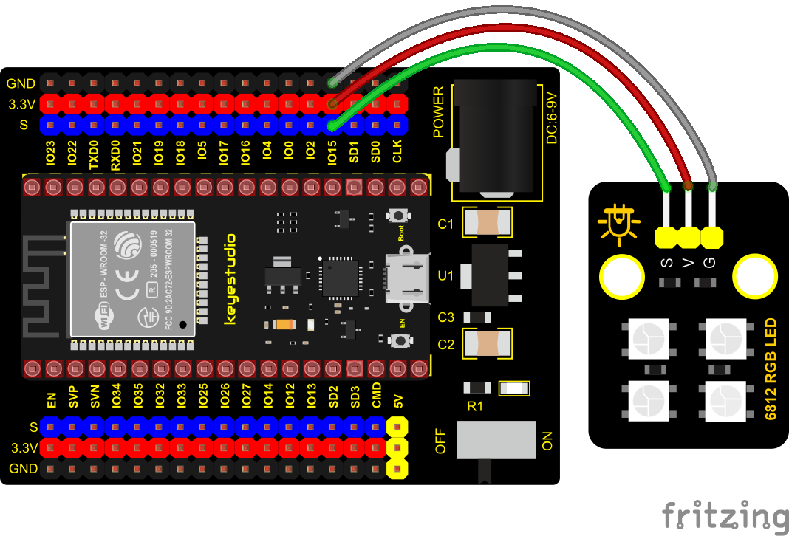

**5.Test Code：**

<table>
<tbody>
<tr class="odd">
<td>
#Import Pin, neopiexl and time modules.

from machine import Pin

import neopixel

import time

#Define the number of pin and LEDs connected to neopixel.

pin = Pin(15, Pin.OUT)

np = neopixel.NeoPixel(pin, 4)

#brightness :0-255

brightness=100

colors=[[brightness,0,0], #red

[0,brightness,0], #green

[0,0,brightness], #blue

[brightness,brightness,brightness], #white

[0,0,0]] #close

#Nest two for loops to make the module repeatedly display five states of red, green, blue, white and OFF.

while True:

for i in range(0,5):

for j in range(0,4):

np[j]=colors[i]

np.write()

time.sleep_ms(50)

time.sleep_ms(500)

time.sleep_ms(500)
</td>
</tr>
</tbody>
</table>

**6. Code Explanation**

A few function ports and functions:

**np = neopixel.NeoPixel(pin, 4)** , there are four LED beads, so we set
to 4.

**pin = Pin(15, Pin.OUT)** , this is the pin number, we connect to GP15.

**brightness = 100**, brightness setting 255 implies brightest.

**7. Test Result**

Wire up and power on. Click “Run current script”,
the code starts executing. Then we can see the four RGB LEDs show red,
green, blue and white color; as shown below;

Press “Ctrl+C”or click“Stop/Restart backend”to
exit the program.

### Project 30: Rotary Encoder

1.  **Overview**

In this kit, there is a Keyestudio rotary encoder, dubbed as switch
encoder. It is applied to automotive electronics, multimedia audio,
instrumentation, household appliances, smart home, medical equipment and
so on.

In the experiment, it it used for counting. When we rotate the rotary
encoder clockwise, the set data falls by 1; if you rotate it
anticlockwise, the set data is up 1; and when the middle button is
pressed, the value will be show on Shell.

**2. Working Principle**

The incremental encoder converts the displacement into a periodic electric signal, and then converts this signal into a counting pulse, and the number of pulses indicates the size of the displacement.This module mainly uses 20-pulse rotary encoder components. It can calculate the number of pulses output during clockwise and reverse rotation. There is no limit to count rotation. It resets to the initial state, that is, starts counting from 0.           

**3.Required Components**

<table>
<tbody>
<tr class="odd">
<td></td>
<td></td>
<td></td>
<td></td>
<td></td>
</tr>
<tr class="even">
<td>ESP32 Board*1</td>
<td>ESP32 Expansion Board*1</td>
<td>Keyestudio Rotary Encoder*1</td>
<td>5P Dupont Wire*1</td>
<td>Micro USB Cable*1</td>
</tr>
</tbody>
</table>

**4.Wiring Diagram**

**5.Add Library：**

Open“Thonny”, click“This computer”→“D:”→“2.
ESP32\_code\_MicroPython”→“lesson 30. Rotary encoder counting”.
Choose“rotary.py”and“rotary\_irq\_rp2.py”，right-click“Upload to /”.

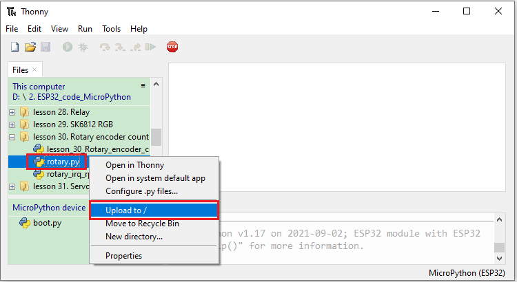

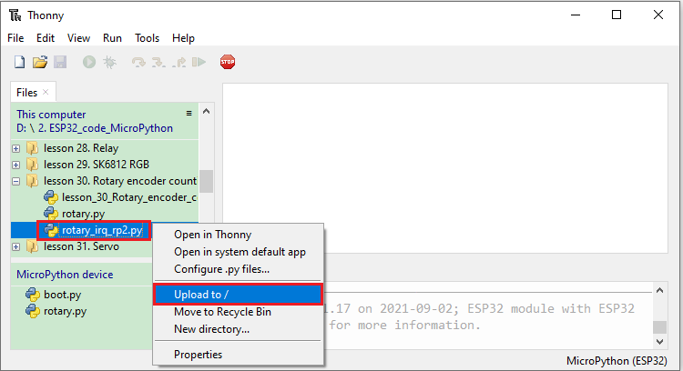

4.  **Test Code：**

<table>
<tbody>
<tr class="odd">
<td>
import time

from rotary_irq_rp2 import RotaryIRQ

from machine import Pin

SW=Pin(27,Pin.IN,Pin.PULL_UP)

r = RotaryIRQ(pin_num_clk=12,

pin_num_dt=14,

min_val=0,

reverse=False,

range_mode=RotaryIRQ.RANGE_UNBOUNDED)

val_old = r.value()

while True:

try:

val_new = r.value()

if SW.value()==0 and n==0:

print("Button Pressed")

print("Selected Number is : ",val_new)

n=1

while SW.value()==0:

continue

n=0

if val_old != val_new:

val_old = val_new

print('result =', val_new)

time.sleep_ms(50)

except KeyboardInterrupt:

break
</td>
</tr>
</tbody>
</table>

**7. Code Explanation**

1.  We will see the file rotary.py and rotary\_irq\_rp2.py. This means
    that we save them in the ESP32 successfully. Then we can use **from
    rotary\_irq\_rp2 import RotaryIRQ.**

2.  **SW=Pin(20,Pin.IN,Pin.PULL\_UP)** indicates that the SW pin is
    connected to GPIO27, **pin\_num\_clk=12** indicates that the pin CLK
    is connected to GPIO12, and **pin\_num\_dt=14** means that the DT
    pin is connected to GPIO14. We can change these pin numbers.

3.  **try/except** is the python language exception capture processing
    statement, **try** executes the code, **except** executes the code
    when an exception occurs, and when we press Ctrl+C, the program
    exits.

4.  **r.value()** returns the value of the encoder

Wire up and power on. Click “Run current script”,
the code starts executing. Rotate the encoder clockwise, the displayed
data decrease; rotate the encoder counterclockwise, the displayed data
increase; press the middle button of the encoder, the displayed data is
the value of the encoder, as shown in the figure below. Press“Ctrl+C”or
click“Stop/Restart backend”to exit the program.

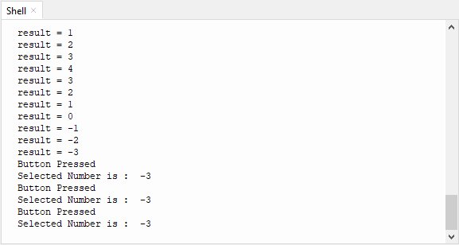

### Project 31: Servo Control

1.  **Overview**

Servo motor is a position control rotary actuator. It mainly consists of
a housing, a circuit board, a core-less motor, a gear and a position
sensor. Its working principle is that the servo receives the signal sent
by MCU or receiver and produces a reference signal with a period of 20ms
and width of 1.5ms, then compares the acquired DC bias voltage to the
voltage of the potentiometer and obtain the voltage difference output.

In general, servo has three lines in brown, red and orange. The brown
wire is grounded, the red one is a positive pole line and the orange one
is a signal line.

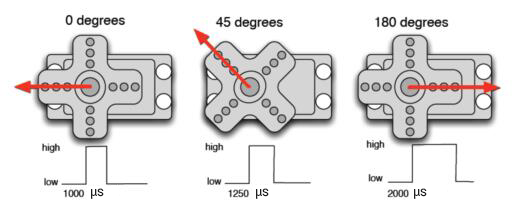

**2. Working Principle**

When the motor speed is constant, the potentiometer is driven to rotate
through the cascade reduction gear, which leads that the voltage
difference is 0, and the motor stops rotating. Generally, the angle
range of servo rotation is 0° --180 °

The rotation angle of servo motor is controlled by regulating the duty
cycle of PWM (Pulse-Width Modulation) signal. The standard cycle of PWM
signal is 20ms (50Hz). Theoretically, the width is distributed
between 1ms-2ms, but in fact, it's between 0.5ms-2.5ms. The width
corresponds the rotation angle from 0° to 180°. But note that for
different brand motors, the same signal may have different rotation
angles. 

**3.Required Components**

<table>
<tbody>
<tr class="odd">
<td></td>
<td></td>
<td></td>
<td></td>
</tr>
<tr class="even">
<td>ESP32 Board*1</td>
<td>ESP32 Expansion Board*1</td>
<td>Servo*1</td>
<td>Micro USB Cable*1</td>
</tr>
</tbody>
</table>

**4.Wiring Diagram**

**5.Test Code1：**

<table>
<tbody>
<tr class="odd">
<td>
from machine import Pin, PWM

import time

pwm = PWM(Pin(4))

pwm.freq(50)

'''

Duty cycle corresponding to the Angle

0°----2.5%----25

45°----5%----51.2

90°----7.5%----77

135°----10%----102.4

180°----12.5%----128

'''

angle_0 = 25

angle_90 = 77

angle_180 = 128

while True:

pwm.duty(angle_0)

time.sleep(1)

pwm.duty(angle_90)

time.sleep(1)

pwm.duty(angle_180)

time.sleep(1)
</td>
</tr>
</tbody>
</table>

**6. Code Explanation 1**

According to the angle of the signal pulse width, it is converted into a
duty cycle. The formula is: 2.5+angle/180\*10. The PWM pin resolution of
ESP32 is 2^10 = 1024. When converted to 0 degree, its duty cycle is 1024
\* 2.5% = 25.6 , when the angle is 180 degrees, its duty cycle value is
1024\* 12.5% = 128, these two values will be related to the program,
considering the error and rotation angle, I set the duty cycle at
between 10 and 150, the servo can rotate smoothly 0\~180 degrees

**7. Test Result 1：**

Wire up and power on. Click “Run current script”,
the code starts executing. the servo will rotate 0°，90° and 180°
cyclically. Press “Ctrl+C”or click“Stop/Restart
backend” to exit the program.

**8.Test Code2：**

<table>
<tbody>
<tr class="odd">
<td>
from utime import sleep

from machine import Pin

from machine import PWM

pwm = PWM(Pin(4))#Steering gear pin is connected to GP4.

pwm.freq(50)#20ms period, so the frequency is 50Hz

'''

Duty cycle corresponding to the Angle

0°----2.5%----25

45°----5%----51.2

90°----7.5%----77

135°----10%----102.4

180°----12.5%----128

'''

# Set the servo motor rotation Angle

def setServoCycle (position):

pwm.duty(position)

sleep(0.01)

# Convert the rotation Angle to duty cycle

def convert(x, i_m, i_M, o_m, o_M):

return max(min(o_M, (x - i_m) * (o_M - o_m) // (i_M - i_m) + o_m), o_m)

while True:

for degree in range(0, 180, 1):#servo goes from 0 to 180

pos = convert(degree, 0, 180, 20, 150)

setServoCycle(pos)

for degree in range(180, 0, -1):#servo goes from 180 to 0

pos = convert(degree, 0, 180, 20, 150)

setServoCycle(pos)
</td>
</tr>
</tbody>
</table>

**9. Code Explanation 2**

**convert(x, i\_m, i\_M, o\_m, o\_M)**: x is the value we want to map;
**i\_m, i\_M** are the lower and upper limits of the current value;
o\_m, o\_M are the lower and upper limits of the target range we want to
map to.

**10. Test Result 2**

Wire up and power on. Click “Run current script”,
the code starts executing. The servo rotates from 0° to 180° by moving
1° for each 15ms. Press “Ctrl+C”or
click“Stop/Restart backend”to exit the program.

### Project 32: Ultrasonic Sensor

Bats and some marine animals are able to use high frequencies of sound
for echolocation or communication. They can emit ultrasonic waves from
the larynx through the mouth or nose and use the sound waves that bounce
back to orient and determine the position, size and whether nearby
objects are moving. Ultrasonic is a frequency higher than 20000 Hz sound
wave, which has a good direction, a strong penetration ability, and is
easy to obtain more concentrated sound energy as well as spread far in
the water. It can be used for ranging, speed measurement, cleaning,
welding, gravel, sterilization and disinfection. What‘s more, it has
many applications in medicine, military, industry and agriculture.

1.  **Overview**

In this kit, there is a keyes HC-SR04 ultrasonic sensor, which can
detect obstacles in front and the detailed distance between the sensor
and the obstacle. Its principle is the same as that of bat flying. It
can emit the ultrasonic signals that cannot be heard by humans. When
these signals hit an obstacle and come back immediately. The distance
between the sensor and the obstacle can be calculated by the time gap of
emitting signals and receiving signals.

In the experiment, we use the sensor to detect the distance between the
sensor and the obstacle, and print the test result.

**2. Working Principle**

The most common ultrasonic ranging method is the echo detection. As
shown below; when the ultrasonic emitter emits the ultrasonic waves
towards certain direction, the counter will count. The ultrasonic waves
travel and reflect back once encountering the obstacle. Then the counter
will stop counting when the receiver receives the ultrasonic waves
coming back.

The ultrasonic wave is also sound wave, and its speed of sound V is
related to temperature. Generally, it travels 340m/s in the air.
According to time t, we can calculate the distance s from the emitting
spot to the obstacle.

s=340t/2.

The HC-SR04 ultrasonic ranging module can provide a non-contact distance
sensing function of 2cm-400cm, and the ranging accuracy can reach as
high as 3mm; the module includes an ultrasonic transmitter, receiver and
control circuit. Basic working principle:

1\. First pull down the TRIG, and then trigger it with at least 10us
high level signal;

2\. After triggering, the module will automatically transmit eight 40KHZ
square waves, and automatically detect whether there is a signal to
return.

3\. If there is a signal returned back, through the ECHO to output a
high level, the duration time of high level is actually the time from
emission to reception of ultrasonic.

**3.Required Components**

<table>
<tbody>
<tr class="odd">
<td></td>
<td></td>
<td></td>
<td></td>
<td></td>
</tr>
<tr class="even">
<td>ESP32 Board*1</td>
<td>ESP32 Expansion Board*1</td>
<td>Keyestudio SR01 Ultrasonic Sensor*1</td>
<td>4P Dupont Wire*1</td>
<td>Micro USB Cable*1</td>
</tr>
</tbody>
</table>

**4.Wiring Diagram:**

**5.Test Code：**

<table>
<tbody>
<tr class="odd">
<td>
from machine import Pin

import time

# Define the control pins of the ultrasonic ranging module.

Trig = Pin(13, Pin.OUT, 0)

Echo = Pin(14, Pin.IN, 0)

distance = 0 # Define the initial distance to be 0.

soundVelocity = 340 #Set the speed of sound.

# The getDistance() function is used to drive the ultrasonic module to measure distance,

# the Trig pin keeps at high level for 10us to start the ultrasonic module.

# Echo.value() is used to read the status of ultrasonic module’s Echo pin,

# and then use timestamp function of the time module to calculate the duration of Echo

# pin’s high level,calculate the measured distance based on time and return the value.

def getDistance():

Trig.value(1)

time.sleep_us(10)

Trig.value(0)

while not Echo.value():

pass

pingStart = time.ticks_us()

while Echo.value():

pass

pingStop = time.ticks_us()

pingTime = time.ticks_diff(pingStop, pingStart) // 2

distance = int(soundVelocity * pingTime // 10000)

return distance

# Delay for 2 seconds and wait for the ultrasonic module to stabilize,

# Print data obtained from ultrasonic module every 500 milliseconds.

time.sleep(2)

while True:

time.sleep_ms(500)

distance = getDistance()

print("Distance: ", distance, "cm")
</td>
</tr>
</tbody>
</table>

**6. Test Result**

Wire up and power on. Click “Run current script”,
the code starts executing. The "Shell" window will print the distance
between the ultrasonic sensor and the object. Press“Ctrl+C”or
click“Stop/Restart backend”to exit the program.

### Project 33: IR Receiver Module

1.  **Overview**

There is no doubt that infrared remote control is ubiquitous in daily
life. It is used to control various household appliances, such as TVs,
stereos, video recorders and satellite signal receivers. Infrared remote
control is composed of infrared transmitting and infrared receiving
systems, that is, an infrared remote control and infrared receiving
module and a single-chip microcomputer capable of decoding.

​    

In this experiment, we need to know how to use the infrared receiving
sensor, whichr mainly uses the VS1838B infrared receiving sensor
element. It integrates receiving, amplifying, and demodulating. The
internal IC has already completed the demodulation, and the output is a
digital signal. It can receive 38KHz modulated remote control signal. In
the experiment, we use the IR receiver to receive the infrared signal
emitted by the external infrared transmitting device, and display the
received signal in the shell.

**2. Working Principle**

The main part of the IR remote control system is modulation,
transmission and reception. The modulated carrier frequency is generally
between 30khz and 60khz, and most of them use a square wave of 38kHz and
a duty ratio of 1/3. A 4.7K pull-up resistor R3 is added to the signal
end of the infrared receiver.

**3.Required Components**

<table>
<tbody>
<tr class="odd">
<td></td>
<td></td>
<td></td>
<td></td>
<td></td>
<td></td>
</tr>
<tr class="even">
<td>ESP32 Board*1</td>
<td>ESP32 Expansion Board*1</td>
<td>Keyestudio IR Receiver*1</td>
<td>3P Dupont Wire*1</td>
<td>MicroUSB线*1</td>
<td>Remote Control*1</td>
</tr>
</tbody>
</table>

**4.Wiring Diagram**

**5.Test Code：**

<table>
<tbody>
<tr class="odd">
<td>
import utime

from machine import Pin

ird = Pin(15,Pin.IN)

act = 

def read_ircode(ird):

wait = 1

complete = 0

seq0 = []

seq1 = []

while wait == 1:

if ird.value() == 0:

wait = 0

while wait == 0 and complete == 0:

start = utime.ticks_us()

while ird.value() == 0:

ms1 = utime.ticks_us()

diff = utime.ticks_diff(ms1,start)

seq0.append(diff)

while ird.value() == 1 and complete == 0:

ms2 = utime.ticks_us()

diff = utime.ticks_diff(ms2,ms1)

if diff &gt; 10000:

complete = 1

seq1.append(diff)

code = ""

for val in seq1:

if val &lt; 2000:

if val &lt; 700:

code += "L"

else:

code += "H"

# print(code)

command = ""

for k,v in act.items():

if code == v:

command = k

if command == "":

command = code

return command

while True:

command = read_ircode(ird)

print(command)

utime.sleep(0.5)
</td>
</tr>
</tbody>
</table>

**6. Test Result**

Wire up, power on and click “Run current script”,
the code starts executing. Find the infrared remote control, pull out
the insulating sheet, and press the button at the receiving head of the
infrared receiving sensor. After receiving signals, the LED on the
infrared receiving sensor also starts to flash, as shown in the figure
below. Press“Ctrl+C”or click“Stop/Restart
backend”to exit the program.

### Project 34: DS18B20 Temperature Sensor

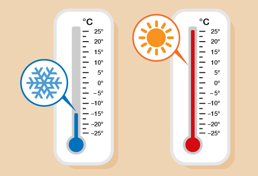

1.  **Description**

In this kit, there is a DS18B20 temperature sensor, which is from maxim.
The MCU can communicate with the DS18B20 through 1-Wire protocol, and
finally read the temperature.  In this experiment, we will use this
temperature sensor to measure the temperature in the current
environment. The test result is **℃**, ranging from -55**℃** to
+125**℃**. We will display the test result on shell.

**2. Working Principle**

The hardware interface of the 1-Wire bus is very simple, just connect
the data pin of the DS18B20 to an IO port of the microcontroller. The
timing of the 1-Wire bus is relatively complex. Many students can’t
understand the timing diagram independently here. We have encapsulated
the complex timing operations in the library, and you can use the
library functions directly.

Schematic Diagram of DS18B20

This can save up to 12-bit temperature vale. In the register, save in
code complement. As shown below;

A total of 2 bytes, LSB is the low byte, MSB is the high byte, where MSb
is the high byte of the byte, LSb is the low byte of the byte. As you
can see, the binary number, the meaning of the temperature represented
by each bit, is expressed. Among them, S represents the sign bit, and
the lower 11 bits are all powers of 2, which are used to represent the
final temperature. The temperature measurement range of DS18B20 is from
-55 degrees to +125 degrees, and the expression form of temperature
data, S represents positive and negative temperature, and the resolution
is 2﹣⒋, which is 0.0625.

**3.Required Components**

<table>
<tbody>
<tr class="odd">
<td></td>
<td></td>
<td></td>
<td></td>
<td></td>
</tr>
<tr class="even">
<td>ESP32 Board*1</td>
<td>ESP32 Expansion Board*1</td>
<td>Keyestudio 18B20 Temperature Sensor*1</td>
<td>3P Dupont Wire*1</td>
<td>Micro USB Cable*1</td>
</tr>
</tbody>
</table>

**4.Wiring Diagram**

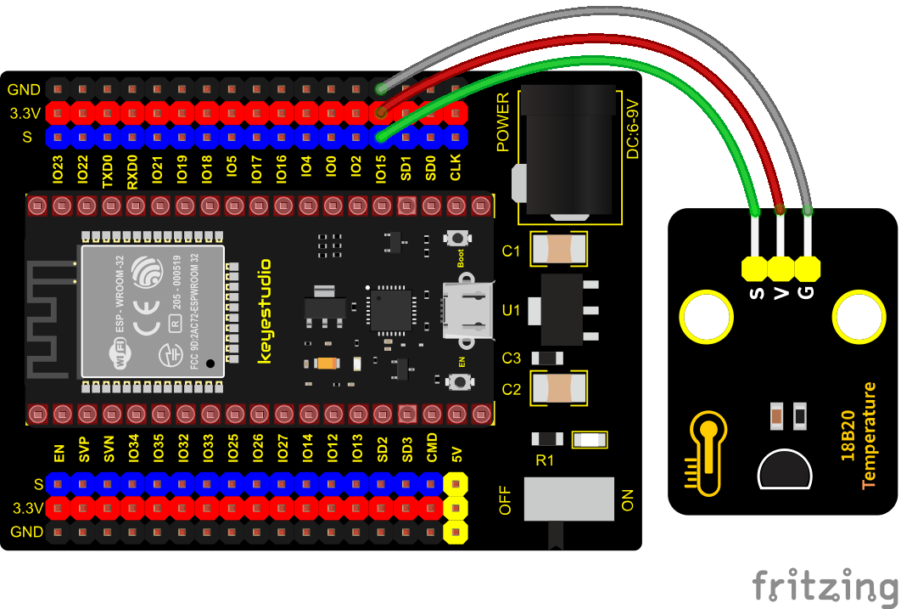

**5. Add Library**

Open Thonny, click “This computer”→“D:”→“2.
ESP32\_code\_MicroPython”→“lesson 34. DS18B20”.
Select“ds18x20.py”and“onewire.py”，right-click and select“Upload to
/”

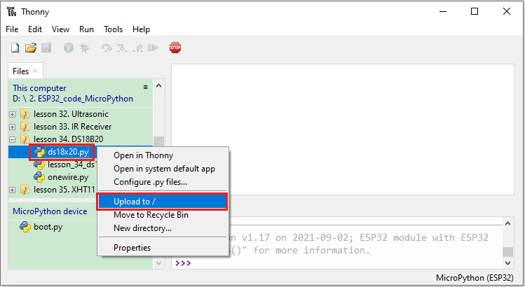

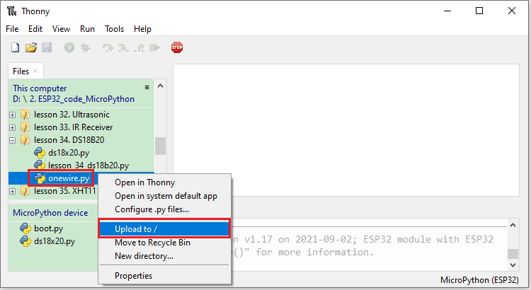

**6.Test Code：**

<table>
<tbody>
<tr class="odd">
<td>
import machine, onewire, ds18x20, time

ds_pin = machine.Pin(15)

ds_sensor = ds18x20.DS18X20(onewire.OneWire(ds_pin))

roms = ds_sensor.scan()

print('Found DS devices: ', roms)

while True:

ds_sensor.convert_temp()

time.sleep_ms(750)

for rom in roms:

#print(rom)

print(ds_sensor.read_temp(rom))

time.sleep(1)
</td>
</tr>
</tbody>
</table>

**7. Code Explanation**

1.  We set the pin to GPIO15 and obtain the temperature in the unit of
    ℃.  

2\. The Shell window displays the temperature value. Ds\_sensor.
Read\_temp (ROM) indicates the temperature value.

 

**8. Test Result**

Wire up, power up and click “Run current script”,
the code starts executing. the shell displays the temperature of the
current environment, as shown below. Press “Ctrl+C”or
click“Stop/Restart backend”to exit the program.

### Project 35: XHT11 Temperature and Humidity Sensor

1.  **Description**

This DHT11 temperature and humidity sensor is a composite sensor which
contains a calibrated digital signal output of the temperature and
humidity.

DHT11 temperature and humidity sensor uses the acquisition technology of
the digital module and temperature and humidity sensing technology,
ensuring high reliability and excellent long-term stability.

It includes a resistive element and a NTC temperature measuring device.

**2. Working Principle**

The communication and synchronization between the single-chip
microcomputer and XHT11 adopts the single bus data format. The
communication time is about 4ms. The data is divided into fractional
part and integer part.

Operation process: A complete data transmission is 40bit, high bit first
out. Data format: 8bit humidity integer data + 8bit humidity decimal
data + 8bit temperature integer data + 8bit temperature decimal data +
8bit checksum

8-bit checksum: 8-bit humidity integer data + 8-bit humidity decimal
data + 8-bit temperature integer data + 8-bit temperature decimal data
"Add the last 8 bits of the result.

**3. Required Components**

<table>
<tbody>
<tr class="odd">
<td></td>
<td></td>
<td></td>
<td></td>
<td></td>
</tr>
<tr class="even">
<td>ESP32 Board*1</td>
<td>ESP32 Expansion Board*1</td>
<td>Keyestudio XHT11 Temperature and Humidity Sensor*1</td>
<td>3P Dupont Wire*1</td>
<td>Micro USB Cable*1</td>
</tr>
</tbody>
</table>

**4.Wiring Diagram**

**5.Test Code：**

<table>
<tbody>
<tr class="odd">
<td>
# Import machine, time and dht modules.

import machine

import time

import dht

#Associate DHT11 with Pin(15).

DHT = dht.DHT11(machine.Pin(15))

# Obtain temperature and humidity data once per second and print them out.

while True:

DHT.measure() # Start DHT11 to measure data once.

# Call the built-in function of DHT to obtain temperature

# and humidity data and print them in “Shell”.

print('temperature:',DHT.temperature(),'℃','humidity:',DHT.humidity(),'%')

time.sleep_ms(1000)
</td>
</tr>
</tbody>
</table>

**6. Test Result**

Wire up, power on and click “Run current script”,
the code starts executing. The shell displays the temperature and
humidity data of the current environment, as shown below.
Press“Ctrl+C”or click“Stop/Restart backend”to
exit the program.

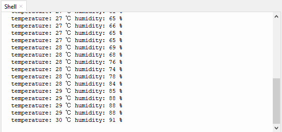

### Project 36: DS1307 Clock Module

1.  **Overview**

This module mainly uses the real-time clock chip DS1307, which is the
I2C bus interface chip that has second, minute, hour, day, month, year
and other functions as well as leap year automatic adjustment function
introduced by DALLAS. It can work independently of CPU, and won‘t’
affected by the CPU main crystal oscillator and capacitance as well as
keep accurate time. What‘s more, monthly cumulative error is generally
less than 10 seconds.The chip also has a clock protection circuit in
case of main power failure and runs on a back-up battery that denies the
CPU read and write access. At the same time, it contains automatic
switching control circuit of standby power supply, so it can guarantee
the accuracy of system clock in case of power failure of main power
supply and other bad environment.

Going forward, the DS1307 chip internal integration has a certain
capacity, with power failure protection characteristics of static RAM,
which can be used to save some key data. 

In the experiment, we use the DS1307 clock
module to obtain the system time and print the test results.  

**2. Working Principle**

Serial real-time clock records year, month, day, hour, minute, second
and week; AM and PM indicate morning and afternoon respectively; 56
bytes of NVRAM store data; 2-wire serial port; programmable square wave
output; power failure detection and automatic switching circuit; battery
current is less than 500nA.

Pins description：X1, 32.768kHz crystal terminal ;

VBAT:X2：+3V input;

SDA：serial data;

SCL：serial clock;

SQW/OUT：square waves/output drivers

**3.Required Components**

<table>
<tbody>
<tr class="odd">
<td></td>
<td></td>
<td></td>
<td></td>
<td></td>
</tr>
<tr class="even">
<td>ESP32 Board*1</td>
<td>ESP32 Expansion Board*1</td>
<td>Keyestudio DS1307 Clock Module*1</td>
<td>4P Dupont Wire*1</td>
<td>Micro USB Cable*1</td>
</tr>
</tbody>
</table>

**4.Wiring Diagram**

**5. Add Library**

Open “Thonny”, click“This computer”→“D:”→“2.
ESP32\_code\_MicroPython”→“lesson 36. DS1307 Real Time Clock”.
Select“urtc.py”，right-click and select“Upload to /”，wait for
the“urtc.py”to be uploaded to the ESP32.

**6.Test Code：**

<table>
<tbody>
<tr class="odd">
<td>
from machine import I2C, Pin

from urtc import DS1307

import utime

i2c = I2C(1,scl = Pin(22),sda = Pin(21),freq = 400000)

rtc = DS1307(i2c)

year = int(input("Year : "))

month = int(input("month (Jan --&gt; 1 , Dec --&gt; 12): "))

date = int(input("date : "))

day = int(input("day (1 --&gt; monday , 2 --&gt; Tuesday ... 0 --&gt; Sunday): "))

hour = int(input("hour (24 Hour format): "))

minute = int(input("minute : "))

second = int(input("second : "))

now = (year,month,date,day,hour,minute,second,0)

rtc.datetime(now)

#(year,month,date,day,hour,minute,second,p1) = rtc.datetime()

while True:

DateTimeTuple = rtc.datetime()

print(DateTimeTuple[0], end = '-')

print(DateTimeTuple[1], end = '-')

print(DateTimeTuple[2], end = ' ')

print(DateTimeTuple[4], end = ':')

print(DateTimeTuple[5], end = ':')

print(DateTimeTuple[6], end = ' week:')

print(DateTimeTuple[3])

utime.sleep(1)
</td>
</tr>
</tbody>
</table>

**7. Code Explanation**

**rtc.datetime()：**Return a tuple of time. When the program is running,
we set the "please input" program, run the code, it will prompt us to
input the time and date, after the input is completed, the data will be
printed every second.

**DateTimeTuple\[0\]:** save years

**DateTimeTuple\[1\]:** save months

**DateTimeTuple\[2\]**: save days

**DateTimeTuple\[3\]**: save weeks

**Rtc.GetDateTime().Month():** return months

**DateTimeTuple\[4\]:** save hours

**DateTimeTuple\[5\]**: save minutes

**DateTimeTuple\[6\]:** save seconds

**8. Test Result**

Wire up, power on and click “Run current script”,
the code starts

executing. the shell will display“Year:”. Then we enter year, month,day,
hour, minute and second,once complete, printed the data every second, as
shown below. Press “Ctrl+C”or click “Stop/Restart
backend”to exit the program.

### Project 37: TM1650 4-Digit Tube Display

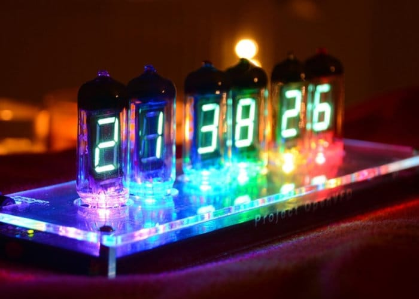

**1. Overview**

This module is mainly composed of a 0.36 inch red common anode 4-digit
digital tube, and its driver chip is TM1650. When using it, we only need
two signal lines to make the single-chip microcomputer control a
4-bitdigit tube, which greatly saves the IO port resources of the
control board.

TM1650 is a special circuit for LED (light emitting diode display) drive
control. It integrates MCU input and output control digital interface,
data latch, LED drivers, keyboard scanning, brightness adjustment and
other circuits.

TM1650 has stable performance, reliable quality and strong
anti-interference ability.

It can be applied to the application of long-term continuous working for
24 hours.

TM1650 uses 2-wire serial transmission protocol for communication (note
that this data transmission protocol is not a standard I2C protocol).
The chip can drive the digital tube and save MCU pin resources through
two pins and MCU communication.

**2. Working Principle**

TM1650 adopts IIC treaty, which uses DIO and CLK buses.

**Data command setting**: 0x48 means that we light up the digital tube,
instead of enable the function of key scanning

**Command display setting:**

bit\[6:4\]：set the brightness of tube display, and 000 is brightest

bit\[3\]：set to show decimal points

bit\[0\]：start the display of the tube display

**3.Required Components**

<table>
<tbody>
<tr class="odd">
<td></td>
<td></td>
<td></td>
<td></td>
<td></td>
</tr>
<tr class="even">
<td>ESP32 Board*1</td>
<td>ESP32 Expansion Board*1</td>
<td>Keyestudio TM16504-Digit Segment Display*1</td>
<td>4P Dupont Wire*1</td>
<td>Micro USB Cable*1</td>
</tr>
</tbody>
</table>

**4.Wiring Diagram**

**5.Test Code：**

<table>
<tbody>
<tr class="odd">
<td>
from machine import Pin

import time

# definitions for TM1650

ADDR_DIS = 0x48 #mode command

ADDR_KEY = 0x49 #read key value command

# definitions for brightness

BRIGHT_DARKEST = 0

BRIGHT_TYPICAL = 2

BRIGHTEST = 7

on = 1

off = 0

# number:0~9

NUM = [0x3f,0x06,0x5b,0x4f,0x66,0x6d,0x7d,0x07,0x7f,0x6f]

# DIG = [0x68,0x6a,0x6c,0x6e]

DIG = [0x6e,0x6c,0x6a,0x68]

DOT = [0,0,0,0]

clkPin = 22

dioPin = 21

clk = Pin(clkPin, Pin.OUT)

dio = Pin(dioPin, Pin.OUT)

DisplayCommand = 0

def writeByte(wr_data):

global clk,dio

for i in range(8):

if(wr_data &amp; 0x80 == 0x80):

dio.value(1)

else:

dio.value(0)

clk.value(0)

time.sleep(0.0001)

clk.value(1)

time.sleep(0.0001)

clk.value(0)

wr_data &lt;&lt;= 1

return

def start():

global clk,dio

dio.value(1)

clk.value(1)

time.sleep(0.0001)

dio.value(0)

return

def ack():

global clk,dio

dy = 0

clk.value(0)

time.sleep(0.0001)

dio = Pin(dioPin, Pin.IN)

while(dio.value() == 1):

time.sleep(0.0001)

dy += 1

if(dy&gt;5000):

break

clk.value(1)

time.sleep(0.0001)

clk.value(0)

dio = Pin(dioPin, Pin.OUT)

return

def stop():

global clk,dio

dio.value(0)

clk.value(1)

time.sleep(0.0001)

dio.value(1)

return

def displayBit(bit, num):

global ADDR_DIS

if(num &gt; 9 and bit &gt; 4):

return

start()

writeByte(ADDR_DIS)

ack()

writeByte(DisplayCommand)

ack()

stop()

start()

writeByte(DIG[bit-1])

ack()

if(DOT[bit-1] == 1):

writeByte(NUM[num] | 0x80)

else:

writeByte(NUM[num])

ack()

stop()

return

def clearBit(bit):

if(bit &gt; 4):

return

start()

writeByte(ADDR_DIS)

ack()

writeByte(DisplayCommand)

ack()

stop()

start()

writeByte(DIG[bit-1])

ack()

writeByte(0x00)

ack()

stop()

return

def setBrightness(b = BRIGHT_TYPICAL):

global DisplayCommand,brightness

DisplayCommand = (DisplayCommand &amp; 0x0f)+(b&lt;&lt;4)

return

def setMode(segment = 0):

global DisplayCommand

DisplayCommand = (DisplayCommand &amp; 0xf7)+(segment&lt;&lt;3)

return

def displayOnOFF(OnOff = 1):

global DisplayCommand

DisplayCommand = (DisplayCommand &amp; 0xfe)+OnOff

return

def displayDot(bit, OnOff):

if(bit &gt; 4):

return

if(OnOff == 1):

DOT[bit-1] = 1;

else:

DOT[bit-1] = 0;

return

def InitDigitalTube():

setBrightness(2)

setMode(0)

displayOnOFF(1)

for _ in range(4):

clearBit(_)

return

def ShowNum(num): #0~9999

displayBit(1,num%10)

if(num &lt; 10):

clearBit(2)

clearBit(3)

clearBit(4)

if(num &gt; 9 and num &lt; 100):

displayBit(2,num//10%10)

clearBit(3)

clearBit(4)

if(num &gt; 99 and num &lt; 1000):

displayBit(2,num//10%10)

displayBit(3,num//100%10)

clearBit(4)

if(num &gt; 999 and num &lt; 10000):

displayBit(2,num//10%10)

displayBit(3,num//100%10)

displayBit(4,num//1000)

InitDigitalTube()

while True:

#displayDot(1,on) # on or off, DigitalTube.Display(bit,number); bit=1---4 number=0---9

for i in range(0,9999):

ShowNum(i)

time.sleep(0.01)
</td>
</tr>
</tbody>
</table>

**6. Code Explanation**

**clkPin = 22、dioPin = 21is pin number**，CLK is connected to GPIO22，DIO
is connected to GPIO21. We can set any two pins at random.

**displayBit(bit, num):** show numbers at bit(1\~4) bit num(0\~9)

**clearBit(bit): clear up** bit(1\~4)

**setBrightness(): brightness setting**

**displayOnOFF()** 0 means OFF, 1 means ON

**displayDot(bit, OnOff)**shows dots，0 means OFF, 1 means ON

**ShowNum(num): show integer** num，in the range of 0\~9999

**7. Test Result**

Wire up and power on. Click “Run current script”,
the code starts executing. The 4-digit tube display will show numbers
from 0 to 99999, an increase of 1 for each 10ms, then start from 0
again. Press“Ctrl+C”or click “Stop/Restart
backend”to exit the program.

### Project 38: HT16K33\_8X8 Dot Matrix Module

1.  **Overview**

What is the dot matrix display?

The 8X8 dot matrix is composed of 64 light-emitting diodes, and each
light-emitting diode is placed at the intersection of the row line and
the column line. When the corresponding row is set to 1 level, and a
certain column is set to 0 level, the corresponding diode will light up.

**2. Working Principle**

As the schematic diagram shown, to light up the LED at the first row and
column, we only need to set C1 to high level and R1 to low level. To
turn on LEDs at the first row, we set R1 to low level and C1-C8 to high
level.

16 IO ports are needed, which will highly waste the MCU resources.

Therefore, we designed this module, using the HT16K33 chip to drive an
8\*8 dot matrix, which greatly saves the resources of the single-chip
microcomputer.

There are three DIP switches on the module, all of which are set to I2C
communication address. The setting method is shown below. A0，A1 and A2
are grounded, that is, the address is 0x70

<table>
<tbody>
<tr class="odd">
<td>A0（1）</td>
<td>A1（2）</td>
<td>A2（3）</td>
<td>A0（1）</td>
<td>A1（2）</td>
<td>A2（3）</td>
<td>A0（1）</td>
<td>A1（2）</td>
<td>A2（3）</td>
</tr>
<tr class="even">
<td>0（OFF）</td>
<td>0（OFF）</td>
<td>0（OFF）</td>
<td>1（ON）</td>
<td>0（OFF）</td>
<td>0（OFF）</td>
<td>0（OFF）</td>
<td>1（ON）</td>
<td>0（OFF）</td>
</tr>
<tr class="odd">
<td>OX70</td>
<td>OX71</td>
<td>OX72</td>
<td></td>
<td></td>
<td></td>
<td></td>
<td></td>
<td></td>
</tr>
<tr class="even">
<td>A0（1）</td>
<td>A1（2）</td>
<td>A2（3）</td>
<td>A0（1）</td>
<td>A1（2）</td>
<td>A2（3）</td>
<td>A0（1）</td>
<td>A1（2）</td>
<td>A2（3）</td>
</tr>
<tr class="odd">
<td>1（ON）</td>
<td>1（ON）</td>
<td>0（OFF）</td>
<td>0（OFF）</td>
<td>0（OFF）</td>
<td>1（ON）</td>
<td>1（ON）</td>
<td>0（OFF）</td>
<td>1（ON）</td>
</tr>
<tr class="even">
<td>OX73</td>
<td>OX74</td>
<td>OX75</td>
<td></td>
<td></td>
<td></td>
<td></td>
<td></td>
<td></td>
</tr>
<tr class="odd">
<td>A0（1）</td>
<td>A1（2）</td>
<td>A2（3）</td>
<td>A0（1）</td>
<td>A1（2）</td>
<td>A2（3）</td>
<td></td>
<td></td>
<td></td>
</tr>
<tr class="even">
<td>0（OFF）</td>
<td>1（ON）</td>
<td>1（ON）</td>
<td>1（ON）</td>
<td>1（ON）</td>
<td>1（ON）</td>
<td></td>
<td></td>
<td></td>
</tr>
<tr class="odd">
<td>OX76</td>
<td>OX77</td>
<td></td>
<td></td>
<td></td>
<td></td>
<td></td>
<td></td>
<td></td>
</tr>
</tbody>
</table>

**3.Required Components**

<table>
<tbody>
<tr class="odd">
<td></td>
<td></td>
<td></td>
<td></td>
<td></td>
</tr>
<tr class="even">
<td>ESP32 Board*1</td>
<td>ESP32 Expansion Board*1</td>
<td>
Keyestudio HT16K33_

8X8 Dot Matrix*1
</td>
<td>4P Dupont Wire*1</td>
<td>Micro USB Cable*1</td>
</tr>
</tbody>
</table>

**4.Wiring Diagram**

**5. Add Library**

Open“This computer”→“D:”→“2. ESP32\_code\_MicroPython”→“lesson 38.
HT16K33 dot matrix”. Select“ht16k33.py”and“ht16k33matrix.py”，right-click
and select“Upload to /”，waiting for
the“ht16k33.py”and“ht16k33matrix.py”to be uploaded to the ESP32.

**6.Test Code：**

<table>
<tbody>
<tr class="odd">
<td>
# IMPORTS

import utime as time

from machine import I2C, Pin, RTC

from ht16k33matrix import HT16K33Matrix

# CONSTANTS

DELAY = 0.01

PAUSE = 3

# START

if __name__ == '__main__':

i2c = I2C(scl=Pin(22), sda=Pin(21))

display = HT16K33Matrix(i2c)

display.set_brightness(2)

# Draw a custom icon on the LED

icon = b"\x00\x66\x00\x00\x18\x42\x3c\x00"

display.set_icon(icon).draw()

# Rotate the icon

display.set_angle(0).draw()

time.sleep(PAUSE)
</td>
</tr>
</tbody>
</table>

**7. Test Result**

Wire up and power on. Click “Run current script”,
the code starts executing.The dot matrix displays a“ smile ”pattern.
Press “Ctrl+C”or click “Stop/Restart backend”to
exit the program.

### Project 39: RFID Module

1.  **Description**

RFIDRFID-RC522 radio frequency module adopts a Philips MFRC522 original
chip to design card reading circuit, easy to use and low cost, suitable
for equipment development and card reader development and so on.

RFID or Radio Frequency Identification system consists of two main
components, a transponder/tag attached to an object to be identified,
and a transceiver also known as interrogator/Reader.

In the experiment, the data read by the card swipe module is 4
hexadecimal numbers, and we print these four hexadecimal numbers as
strings. For example, we read the data of the IC card below: 237,
247,148,90 and the data read from the keychain is: 76, 9, 107, 110.
Different IC cards and different key chains have diverse data.

**2. Working Principle**

Radio frequency identification, the card reader is composed of a radio
frequency module and a high-level magnetic field. The Tag transponder is
a sensing device, and this device does not contain a battery. It only
contains tiny integrated circuit chips and media for storing data and
antennas for receiving and transmitting signals. To read the data in the
tag, first put it into the reading range of the card reader. The reader
will generate a magnetic field, and because the magnetic energy
generates electricity according to Lenz's law, the RFID tag will supply
power, thereby activating the device.

**3.Required Components**

<table>
<tbody>
<tr class="odd">
<td></td>
<td></td>
<td></td>
<td></td>
</tr>
<tr class="even">
<td>ESP32 Board*1</td>
<td>ESP32 Expansion Board*1</td>
<td>Keyestudio RFID Module*1</td>
<td>4P Dupont Wire*1</td>
</tr>
<tr class="odd">
<td></td>
<td></td>
<td></td>
<td></td>
</tr>
<tr class="even">
<td>Micro USB Cable*1</td>
<td>Key*1</td>
<td>IC Card*1</td>
<td></td>
</tr>
</tbody>
</table>

**4.Wiring Diagram**

**5. Add Library**

Open“Thonny”, click“This computer”→“D:”→“2.
ESP32\_code\_MicroPython”→“lesson 39. RFID RC522”.
Select“mfrc522\_config.py”，“mfrc522\_i2c.py”and
“soft\_iic.py”，right-click and select“Upload to /”，waiting for the
“mfrc522\_config.py”，“mfrc522\_i2c.py”and “soft\_iic.py”to be uploaded
to the ESP32.

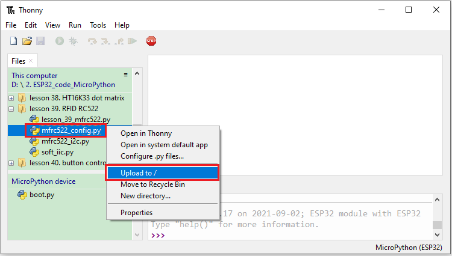

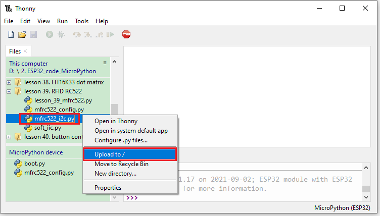

**6.Test Code：**

<table>
<tbody>
<tr class="odd">
<td>
import machine

import time

from mfrc522_i2c import mfrc522

#i2c config

addr = 0x28

scl = 22

sda = 21

rc522 = mfrc522(scl, sda, addr)

rc522.PCD_Init()

rc522.ShowReaderDetails() # Show details of PCD - MFRC522 Card Reader details

while True:

if rc522.PICC_IsNewCardPresent():

#print("Is new card present!")

if rc522.PICC_ReadCardSerial() == True:

print("Card UID:")

print(rc522.uid.uidByte[0 : rc522.uid.size])

#time.sleep(1)
</td>
</tr>
</tbody>
</table>

**7. Code Explanation**

**mfrc522\_config.py;** This is a configuration file that defines some
parameters and commands

**mfrc522\_i2c.py;** Initialization and read and write functions

**Soft\_iic.py;** It is the bottom-level read and write function of
software I2C. We use the io port to simulate I2C here.

**8. Test Result**

Wire up and power on. Click“Run current script”,
the code starts executing. When we make the IC card and key chain close
to the RFID module, the information will be printed out, as shown in the
figure below. Press “Ctrl+C”or click
“Stop/Restart backend”to exit the program.

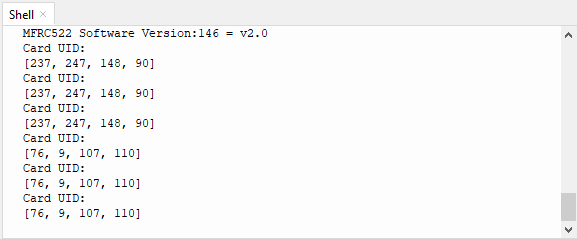

Note: Different **RFID-RC522** door cards and key chains have diverse
values.

**4. Comprehensive Experiments**

The previous projects are related to single sensors or modules. In the
following part, we will combine various sensors and modules to create
some comprehensive experiments to perform special functions.

### Project 40: Button-controlled LED

**1. Overview**

In this lesson, we will make an extension experiment with a button and
an LED. When the button is pressed and low levels are output, the LED
will light up; when the button is released, the LED will go off. Then we
can control a module with another module.

**2.Required Components**

<table>
<tbody>
<tr class="odd">
<td></td>
<td></td>
<td></td>
<td></td>
<td></td>
<td></td>
</tr>
<tr class="even">
<td>ESP32 Board*1</td>
<td>ESP32 Expansion Board*1</td>
<td>Keyestudio Purple LED Module*1</td>
<td>Keyestudio Button Module*1</td>
<td>3P Dupont Wire*2</td>
<td>Micro USB Cable*1</td>
</tr>
</tbody>
</table>

**3.Wiring Diagram**

**4.Test Code：**

<table>
<tbody>
<tr class="odd">
<td>
from machine import Pin

import time

led = Pin(4, Pin.OUT) # create LED object from Pin 4,Set Pin 4 to output

button = Pin(15, Pin.IN, Pin.PULL_UP) #Create button object from Pin15,Set GP15 to input

#Customize a function and name it reverseGPIO(),which reverses the output level of the LED

def reverseGPIO():

if led.value():

led.value(0) #Set led turn off

else:

led.value(1) #Set led turn on

try:

while True:

if not button.value():

time.sleep_ms(20)

if not button.value():

reverseGPIO()

while not button.value():

time.sleep_ms(20)

except:

pass
</td>
</tr>
</tbody>
</table>

**5. Test Result**

Wire up, power on and click “Run current script”,
the code starts executing. When the button is pressed, the LED will
light up; when pressed again, the LED will go off., cycle this
operation. Press“Ctrl+C”or “Stop/Restart backend”to exit the program.

### Project 41: Alarm Experiment

1.  **Overview**

In the previous experiment, we control an output module though an input
module. In this lesson, we will make an experiment that the active
buzzer will emit sounds once an obstacle appears.

**2.Required Components**

<table>
<tbody>
<tr class="odd">
<td></td>
<td></td>
<td></td>
<td></td>
<td></td>
<td></td>
</tr>
<tr class="even">
<td>ESP32 Board*1</td>
<td>ESP32 Expansion Board*1</td>
<td>Keyestudio Obstacle Avoidance Sensor*1</td>
<td>Keyestudio Active Buzzer*1</td>
<td>3P Dupont Wire*2</td>
<td>Micro USB Cable*1</td>
</tr>
</tbody>
</table>

**3.Wiring Diagram**

**4.Test Code：**

<table>
<tbody>
<tr class="odd">
<td>
from machine import Pin

import time

buzzer = Pin(4, Pin.OUT)

sensor = Pin(15, Pin.IN)

while True:

buzzer.value(not(sensor.value()))

time.sleep(0.01)
</td>
</tr>
</tbody>
</table>

**5. Code Explanation**

When an obstacle is detected, sensor.value() will return a low level
signal. So when an obstacle is detected, the GPIO4 connected to the
buzzer pin will output a high level signal, the buzzer will emit sounds.

**6. Test Result**

Wire up, power on and click “Run current script”,
the code starts executing. The active buzzer will emit sound if
detecting obstacles; otherwise, it won’t emit sound. Press “Ctrl+C” or
click “Stop/Restart backend” to exit the program.

### Project 42: Intrusion Detection

1.  **Description**

In this experiment, we use a PIR motion sensor to control an active
buzzer to emit sounds and the onboard LED to flash rapidly.

**2.Required Components**

<table>
<tbody>
<tr class="odd">
<td></td>
<td></td>
<td></td>
<td></td>
</tr>
<tr class="even">
<td>ESP32 Board*1</td>
<td>ESP32 Expansion Board*1</td>
<td>Keyestudio PIR Motion Sensor*1</td>
<td>Keyestudio Active Buzzer*1</td>
</tr>
<tr class="odd">
<td></td>
<td></td>
<td></td>
<td></td>
</tr>
<tr class="even">
<td>Keyestudio Purple LED Module*1</td>
<td>3P Dupont Wire*3</td>
<td>Micro USB Cable*1</td>
<td></td>
</tr>
</tbody>
</table>

**3.Wiring Diagram**

**4.Test Code：**

<table>
<tbody>
<tr class="odd">
<td>
# Import Pin and time modules.

from machine import Pin

import time

# Define the pins of the Human infrared sensor,led and Active buzzer.

sensor_pir = Pin(15, Pin.IN)

led = Pin(22, Pin.OUT)

buzzer = Pin(4, Pin.OUT)

while True:

if sensor_pir.value():

print("Warning! Intrusion detected！")

buzzer.value(1)

led.value(1)

time.sleep(0.2)

buzzer.value(0)

led.value(0)

time.sleep(0.2)

else:

buzzer.value(0)

led.value(0)
</td>
</tr>
</tbody>
</table>

**5. Test Result**

Wire up and power on. Click“Run current script”,
the code starts executing. If the PIR sensor detects someone moving
nearby, the buzzer will emit an alarm , and the LED will flash
continuously. At the same time, the“shell” will diaplay “Warning\!
Intrusion detected\!”Press“Ctrl+C”or click
“Stop/Restart backend”to exit the program.

### Project 43: Extinguishing Robot

1.  **Description**

Today we will use Arduino simulation to build an extinguishing robot
that will automatically sense the fire and start the fan. In this
project we will learn how to build a very simple robot using ESP32,
(detecting flames with a flame sensor, blowing out candles with a fan)
can teach us basic concepts about robotics. Once you understand the
basics below, you can build more complex robots.

**2.Required Components**

<table>
<tbody>
<tr class="odd">
<td></td>
<td></td>
<td></td>
<td></td>
</tr>
<tr class="even">
<td>ESP32 Board*1</td>
<td>ESP32 Expansion Board*1</td>
<td>Keyestudio 130 Motor*1</td>
<td>Keyestudio Flame Sensor*1</td>
</tr>
<tr class="odd">
<td></td>
<td></td>
<td></td>
<td></td>
</tr>
<tr class="even">
<td>3P Dupont Wire*1</td>
<td>4P Dupont Wire*1</td>
<td>Micro USB Cable*1</td>
<td>6 AA Battery Holder*1</td>
</tr>
<tr class="odd">
<td></td>
<td></td>
<td></td>
<td></td>
</tr>
<tr class="even">
<td>AA Battery(not included)*6</td>
<td></td>
<td></td>
<td></td>
</tr>
</tbody>
</table>

**3.Wiring Diagram**

**4.Test Code：**

<table>
<tbody>
<tr class="odd">
<td>
# Import Pin and ADCmodules.

from machine import ADC,Pin

import time

# Turn on and configure the ADC with the range of 0-3.3V

adc=ADC(Pin(34))

adc.atten(ADC.ATTN_11DB)

adc.width(ADC.WIDTH_12BIT)

#Two pins of the moto

INA = Pin(15, Pin.OUT) #INA corresponds to IN+

INB = Pin(4, Pin.OUT) #INB corresponds to IN-

while True:

adcVal=adc.read()

print(adcVal)

if adcVal &lt; 3000:

#open

INA.value(0)

INB.value(1)

else:

#stop

INA.value(0)

INB.value(0)

time.sleep(0.1)
</td>
</tr>
</tbody>
</table>

**5. Code Explanation**

In the code, we set the threshold value to 3000. When the ADC value
detected by the flame sensor is lower than the threshold value, the fan
will be automatically turned on; otherwise, it will be turned off. For
the driving method of the fan, please refer to the 130 Motor.

**6. Test Result**

Wire up, power on and turn the DIP switch to the ON end, click
“Run current script”, the code starts executing.
The shell prints the flame value. When this value is less than 3000, the
fan will work to blow out the fire. Basically, the flame value can be
set by yourself. Press “Ctrl+C”or click
“Stop/Restart backend”to exit the program.

### Project 44: Rotary Encoder control RGB

1.  **Introduction**

In this lesson, we will control the LED on the RGB module to show
different colors through a rotary encoder.

When designing the code, we need to divide the obtained values by 3 to
get the remainders. The remainder is 0 and the LED will become red. The
remainder is 1, the LED will become green. The remainder is 2, the LED
will turn blue.

**2.Required Components**

<table>
<tbody>
<tr class="odd">
<td></td>
<td></td>
<td></td>
<td></td>
</tr>
<tr class="even">
<td>ESP32 Board*1</td>
<td>ESP32 Expansion Board*1</td>
<td>
Keyestudio

Common Cathode RGB Module*1
</td>
<td>
Keyestudio

Rotary Encoder Module*1
</td>
</tr>
<tr class="odd">
<td></td>
<td></td>
<td></td>
<td></td>
</tr>
<tr class="even">
<td>5P Dupont Wire*1</td>
<td>4P Dupont Wire*1</td>
<td>Micro USB Cable*1</td>
<td></td>
</tr>
</tbody>
</table>

**3.Wiring Diagram**

**4. Add Library**

Open“Thonny”, click “This computer”→“D:”→“2.
ESP32\_code\_MicroPython”→”lesson 44. Encoder control RGB”.
Select“rotary.py”and“rotary\_irq\_rp2.py”，right-click and
select“Upload to /”，waiting for the
“rotary.py”and“rotary\_irq\_rp2.py”to be uploaded to the ESP32.

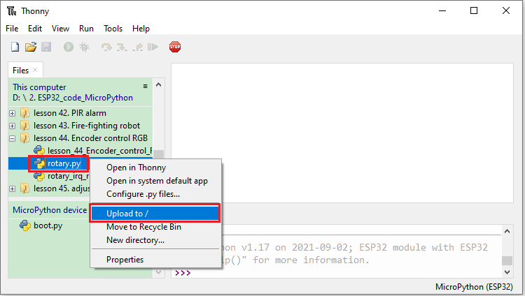

**5.Test Code：**

<table>
<tbody>
<tr class="odd">
<td>
import time

from rotary_irq_rp2 import RotaryIRQ

from machine import Pin, PWM

pwm_r = PWM(Pin(0))

pwm_g = PWM(Pin(2))

pwm_b = PWM(Pin(15))

pwm_r.freq(1000)

pwm_g.freq(1000)

pwm_b.freq(1000)

def light(red, green, blue):

pwm_r.duty(red)

pwm_g.duty(green)

pwm_b.duty(blue)

SW=Pin(27,Pin.IN,Pin.PULL_UP)

r = RotaryIRQ(pin_num_clk=12,

pin_num_dt=14,

min_val=0,

reverse=False,

range_mode=RotaryIRQ.RANGE_UNBOUNDED)

while True:

val = r.value()

print(val%3)

if val%3 == 0:

light(4950, 0, 0)

elif val%3 == 1:

light(0, 4950, 0)

elif val%3 == 2:

light(0, 0, 4950)

time.sleep(0.1)
</td>
</tr>
</tbody>
</table>

**6. Code Explanation**

In the experiment, we set the val to the remainder of Encoder\_Count
divided by 3. Encoder\_Count is the value of the encoder. Then we can
set pin GPIO0 (red), GPIO2 (green) and GPIO15 (blue) according to
remainders.

Colors of the LEDs can be controlled by remainders.

**7. Test Result**

Wire up, power on and click “Run current script”,
the code starts executing. Rotate the knob of the rotary encoder to
display the reminders, which can control colors of LED(red green blue).
Press “Ctrl+C”or click “Stop/Restart backend” to
exit the program.

### Project 45: Rotary Potentiometer

1.  **Introduction**

In the previous courses, we did experiments of breathing light and
controlling LED with button. In this course, we do these two experiments
by controlling the brightness of LED through an adjustable
potentiometer. The brightness of LED is controlled by PWM values, and
the range of analog values is 0 to 4095 and the PWM value range is
0-255.

After the code is set successfully, we can control the brightness of the
LED on the module by rotating the potentiometer.

**2.Required Components**

<table>
<tbody>
<tr class="odd">
<td></td>
<td></td>
<td></td>
<td></td>
<td></td>
<td></td>
</tr>
<tr class="even">
<td>ESP32 Board*1</td>
<td>ESP32 Expansion Board*1</td>
<td>Keyestudio Purple LED Module*1</td>
<td>Keyestudio Rotary Potentiometer*1</td>
<td>3P Dupont Wire*2</td>
<td>Micro USB Cable*1</td>
</tr>
</tbody>
</table>

**3.Wiring Diagram**

**4.Test Code：**

<table>
<tbody>
<tr class="odd">
<td>
from machine import Pin,PWM,ADC

import time

pwm =PWM(Pin(15,Pin.OUT),1000)

adc=ADC(Pin(34))

adc.atten(ADC.ATTN_11DB)

adc.width(ADC.WIDTH_10BIT)

try:

while True:

adcValue=adc.read()

pwm.duty(adcValue)

print(adc.read())

time.sleep_ms(100)

except:

pwm.deinit()
</td>
</tr>
</tbody>
</table>

**5. Code Explanation**

It is easy to control the brightness of the LED light by a
potentiometer. Here we can find that MicroPython unifies the value range
of the ADC between 0 and 1023, and assigns values directly, which is
simple and convenient.

**6. Test Result**

Wire up, power on and click “Run current script”,
the code starts executing. Rotating the potentiometer on the module can
adjust the brightness of the LED on the LED module. Press“Ctrl+C”or
click “Stop/Restart backend”to exit the program.

### Project 46: Smart Windows

1.  **Description**

In life, we can see all kinds of smart products, such as smart home.
Smart homes include smart curtains, smart windows, smart TVs, smart
lights, and more. In this experiment, we use a steam sensor to detect
rainwater, and then achieve the effect of closing and opening the window
by a servo.

**2.Required Components**

<table>
<tbody>
<tr class="odd">
<td></td>
<td></td>
<td></td>
<td></td>
<td></td>
<td></td>
</tr>
<tr class="even">
<td>ESP32 Board*1</td>
<td>ESP32 Expansion Board*1</td>
<td>Keyestudio Steam Sensor*1</td>
<td>Servo*1</td>
<td>3P Dupont Wire*1</td>
<td>Micro USB Cable*1</td>
</tr>
</tbody>
</table>

**3.Wiring Diagram**

**4.Test Code：**

<table>
<tbody>
<tr class="odd">
<td>
# Import Pin and ADC modules.

from machine import ADC,Pin,PWM

import time

# Turn on and configure the ADC with the range of 0-3.3V

adc=ADC(Pin(34))

adc.atten(ADC.ATTN_11DB)

adc.width(ADC.WIDTH_12BIT)

pwm = PWM(Pin(15))#Steering pin connected to GP15

pwm.freq(50)#20ms period, so the frequency is 50Hz

'''

Duty cycle corresponding to the Angle

0°----2.5%----25

45°----5%----51.2

90°----7.5%----77

135°----10%----102.4

180°----12.5%----128

In consideration of the error, the duty cycle is set at 1000~9000, which can smoothly rotate 0~180 degrees

'''

angle_0 = 25

angle_90 = 77

angle_180 = 128

while True:

adcVal=adc.read()

print(adcVal)

if adcVal &gt; 2000:

pwm.duty(angle_0)

time.sleep(0.5)

else:

pwm.duty(angle_180)

time.sleep(0.5)
</td>
</tr>
</tbody>
</table>

**5. Code Explanation**

We can control a servo to rotate by a threshold.

**6. Test Result**

Wire up, power on and click “Run current script”,
the code starts executing. When the sensor detects a certain amount of
water, the servo rotates to achieve the effect of closing or opening
windows. Press“Ctrl+C”or click “Stop/Restart
backend”to exit the program.

### Project 47: Sound Activated Light

1.  **Introduction**

In this lesson, we will make a smart sound activated light using a sound
sensor and an LED module. When we make a sound, the light will
automatically turn on; when there is no sound, the lights will
automatically turn off. How it works? Because the sound-controlled light
is equipped with a sound sensor, and this sensor converts the intensity
of external sound into a corresponding value. Then set a threshold, when
the threshold is exceeded, the light will turn on, and when it is not
exceeded, the light will go out.

**2.Required Components**

<table>
<tbody>
<tr class="odd">
<td></td>
<td></td>
<td></td>
<td></td>
<td></td>
<td></td>
</tr>
<tr class="even">
<td>ESP32 Board*1</td>
<td>ESP32 Expansion Board*1</td>
<td>Keyestudio Sound Sensor*1</td>
<td>Keyestudio Purple LED Module*1</td>
<td>3P Dupont Wire*2</td>
<td>
Micro USB

Cable*1
</td>
</tr>
</tbody>
</table>

**3.Wiring Diagram**

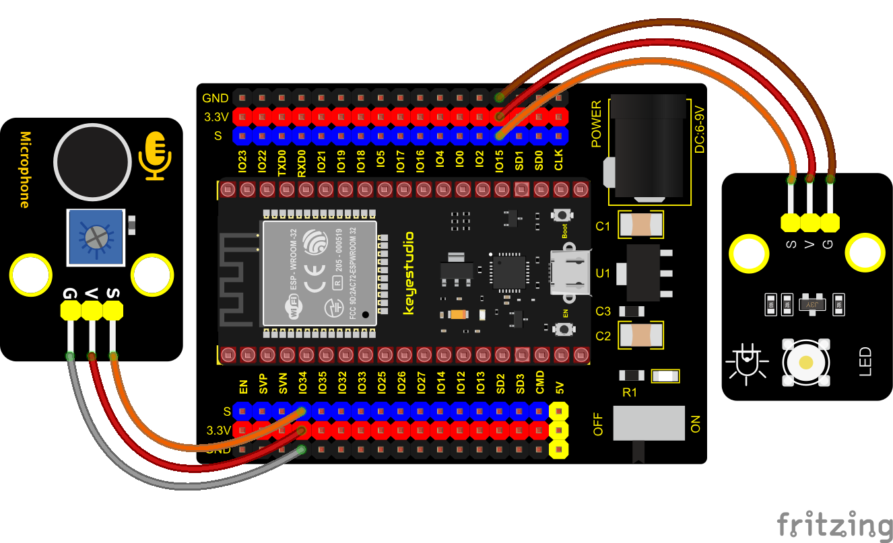

**4.Test Code：**

<table>
<tbody>
<tr class="odd">
<td>
from machine import ADC, Pin

import time

# Turn on and configure the ADC with the range of 0-3.3V

adc=ADC(Pin(34))

adc.atten(ADC.ATTN_11DB)

adc.width(ADC.WIDTH_12BIT)

led = Pin(15,Pin.OUT)

while True:

adcVal=adc.read()

print(adcVal)

if adcVal &gt; 600:

led.value(1)

time.sleep(3)

else:

led.value(0)

time.sleep(0.1)
</td>
</tr>
</tbody>
</table>

**5. Code Explanation**

We set the ADC threshold value to 600. If more than 600, LED will be on
3s; on the contrary, it will be off.

**6. Test Result**

Wire up, power on and click “Run current script”,
the code starts executing. The shell monitor displays the corresponding
volume ADC value. When the analog value of sound is greater than 600,
the LED on the LED module will light up, otherwise it will go off.
Press“Ctrl+C”or click “Stop/Restart backend”to
exit the program.

### Project 48: Fire Alarm

**1. Description**

In this experiment, we will make a fire alarm system. Just use a flame
sensor to control an active buzzer to emit sounds.

**2.Required Components**

<table>
<tbody>
<tr class="odd">
<td></td>
<td></td>
<td></td>
<td></td>
</tr>
<tr class="even">
<td>ESP32 Board*1</td>
<td>ESP32 Expansion Board*1</td>
<td>Keyestudio Active Buzzer*1</td>
<td>keyestudio Flame Sensor*1</td>
</tr>
<tr class="odd">
<td></td>
<td></td>
<td></td>
<td></td>
</tr>
<tr class="even">
<td>MicroUSB线*1</td>
<td>3P Dupont Wire*1</td>
<td>4P Dupont Wire*1</td>
<td></td>
</tr>
</tbody>
</table>

**3.Wiring Diagram**

**4.Test Code：**

<table>
<tbody>
<tr class="odd">
<td>
from machine import Pin

import time

buzzer = Pin(15, Pin.OUT)

sensor = Pin(4, Pin.IN)

while True:

Val = sensor.value()

print(Val)

if Val == 0:

buzzer.value(1)

else:

buzzer.value(0)

time.sleep(0.5)
</td>
</tr>
</tbody>
</table>

**5. Code Explanation**

This flame sensor uses an analog pin and a digital pin. When a flame is
detected, the digital pin outputs a low level. In this experiment we
will use the digital port.

**6. Test Result**

Wire up, power on and click “Run current script”,
the code starts executing. When the sensor detects the flame, the
external active buzzer will emit sounds, otherwise the active buzzer
will not emit sounds. Press “Ctrl+C”or click
“Stop/Restart backend”to exit the program.

### Project 49: Smoke Alarm

1.  **Description**

In this experiment, we will make a smoke alarm by a TM16504-Digit
segment module, a gas sensor and an active buzzer.

**2.Required Components**

<table>
<tbody>
<tr class="odd">
<td></td>
<td></td>
<td></td>
<td></td>
</tr>
<tr class="even">
<td>ESP32 Board*1</td>
<td>ESP32 Expansion Board*1</td>
<td>Keyestudio Active Buzzer*1</td>
<td>Keyestudio TM16504-Digit Segment Module*1</td>
</tr>
<tr class="odd">
<td></td>
<td></td>
<td></td>
<td></td>
</tr>
<tr class="even">
<td>keyestudio Analog Gas Senso*1</td>
<td>4P Dupont Wire*2</td>
<td>4P Dupont Wire*2</td>
<td>Micro USB Cable*1</td>
</tr>
</tbody>
</table>

**3.Wiring Diagram**

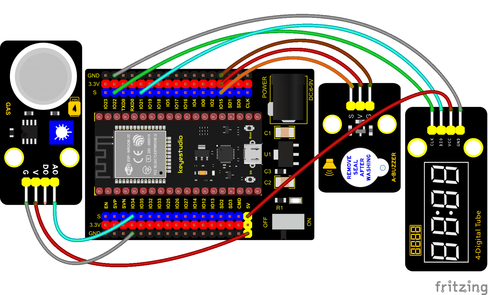

**4.Test Code:**

<table>
<tbody>
<tr class="odd">
<td>
# Import Pin and ADC modules.

from machine import ADC,Pin

import time

# Turn on and configure the ADC with the range of 0-3.3V

adc=ADC(Pin(34))

adc.atten(ADC.ATTN_11DB)

adc.width(ADC.WIDTH_12BIT)

buzzer = Pin(15, Pin.OUT)

# definitions for TM1650

ADDR_DIS = 0x48 #mode command

ADDR_KEY = 0x49 #read key value command

# definitions for brightness

BRIGHT_DARKEST = 0

BRIGHT_TYPICAL = 2

BRIGHTEST = 7

on = 1

off = 0

# number:0~9

NUM = [0x3f,0x06,0x5b,0x4f,0x66,0x6d,0x7d,0x07,0x7f,0x6f]

# DIG = [0x68,0x6a,0x6c,0x6e]

DIG = [0x6e,0x6c,0x6a,0x68]

DOT = [0,0,0,0]

clkPin = 22

dioPin = 21

clk = Pin(clkPin, Pin.OUT)

dio = Pin(dioPin, Pin.OUT)

DisplayCommand = 0

def writeByte(wr_data):

global clk,dio

for i in range(8):

if(wr_data &amp; 0x80 == 0x80):

dio.value(1)

else:

dio.value(0)

clk.value(0)

time.sleep(0.0001)

clk.value(1)

time.sleep(0.0001)

clk.value(0)

wr_data &lt;&lt;= 1

return

def start():

global clk,dio

dio.value(1)

clk.value(1)

time.sleep(0.0001)

dio.value(0)

return

def ack():

global clk,dio

dy = 0

clk.value(0)

time.sleep(0.0001)

dio = Pin(dioPin, Pin.IN)

while(dio.value() == 1):

time.sleep(0.0001)

dy += 1

if(dy&gt;5000):

break

clk.value(1)

time.sleep(0.0001)

clk.value(0)

dio = Pin(dioPin, Pin.OUT)

return

def stop():

global clk,dio

dio.value(0)

clk.value(1)

time.sleep(0.0001)

dio.value(1)

return

def displayBit(bit, num):

global ADDR_DIS

if(num &gt; 9 and bit &gt; 4):

return

start()

writeByte(ADDR_DIS)

ack()

writeByte(DisplayCommand)

ack()

stop()

start()

writeByte(DIG[bit-1])

ack()

if(DOT[bit-1] == 1):

writeByte(NUM[num] | 0x80)

else:

writeByte(NUM[num])

ack()

stop()

return

def clearBit(bit):

if(bit &gt; 4):

return

start()

writeByte(ADDR_DIS)

ack()

writeByte(DisplayCommand)

ack()

stop()

start()

writeByte(DIG[bit-1])

ack()

writeByte(0x00)

ack()

stop()

return

def setBrightness(b = BRIGHT_TYPICAL):

global DisplayCommand,brightness

DisplayCommand = (DisplayCommand &amp; 0x0f)+(b&lt;&lt;4)

return

def setMode(segment = 0):

global DisplayCommand

DisplayCommand = (DisplayCommand &amp; 0xf7)+(segment&lt;&lt;3)

return

def displayOnOFF(OnOff = 1):

global DisplayCommand

DisplayCommand = (DisplayCommand &amp; 0xfe)+OnOff

return

def displayDot(bit, OnOff):

if(bit &gt; 4):

return

if(OnOff == 1):

DOT[bit-1] = 1;

else:

DOT[bit-1] = 0;

return

def InitDigitalTube():

setBrightness(2)

setMode(0)

displayOnOFF(1)

for _ in range(4):

clearBit(_)

return

def ShowNum(num): #0~9999

displayBit(1,num%10)

if(num &lt; 10):

clearBit(2)

clearBit(3)

clearBit(4)

if(num &gt; 9 and num &lt; 100):

displayBit(2,num//10%10)

clearBit(3)

clearBit(4)

if(num &gt; 99 and num &lt; 1000):

displayBit(2,num//10%10)

displayBit(3,num//100%10)

clearBit(4)

if(num &gt; 999 and num &lt; 10000):

displayBit(2,num//10%10)

displayBit(3,num//100%10)

displayBit(4,num//1000)

InitDigitalTube()

while True:

adcVal=adc.read()

print(adcVal)

ShowNum(adcVal)

if adcVal &gt; 1000:

buzzer.value(1)

else:

buzzer.value(0)

time.sleep(0.1)
</td>
</tr>
</tbody>
</table>

**5. Code Explanation**

Define an integer variable adcVal to store the ADC value of the smoke
sensor, and then we display the analog value in the four-digit digital
tube, and then set a threshold, and when the analog value is equal to
the threshold value, the buzzer will beep.

**6. Test Result**

Wire up, power on and click “Run current script”,
the code starts executing. When the concentration of combustible gas
exceeds the threshold value, the active buzzer module will give an
alarm, and the four-digit digital tube will display the concentration
value. Press“Ctrl+C”or click“Stop/Restart
backend”to exit the program.

### Project 50: Ultrasonic Radar

1.  **Description**

We know that bats use echoes to determine the
direction and the location of their preys. In real life, sonar is used
to detect sounds in the water. Since the attenuation rate of
electromagnetic waves in water is very high, it cannot be used to detect
signals, however, the attenuation rate of sound waves in the water is
much smaller, so sound waves are most commonly used underwater for
observation and measurement.In this experiment, we will use a speaker
module, an RGB module and a 4-digit tube display to make a device for
detection through ultrasonic.

**2.Required Components**

<table>
<tbody>
<tr class="odd">
<td></td>
<td></td>
<td></td>
<td></td>
<td></td>
</tr>
<tr class="even">
<td>ESP32 Board*1</td>
<td>ESP32 Expansion Board*1</td>
<td>Keyestudio HC-SR04 Ultrasonic Sensor*1</td>
<td>Keyestudio 8002b Power Amplifier*1</td>
<td>
Keyestudio

Common Cathode RGB Module *1
</td>
</tr>
<tr class="odd">
<td></td>
<td></td>
<td></td>
<td></td>
<td></td>
</tr>
<tr class="even">
<td>Keyestudio TM1650 4-Digit Display*1</td>
<td>4P Dupont Wire*3</td>
<td>3P Dupont Wire*1</td>
<td>Micro USB Cable*1</td>
<td></td>
</tr>
</tbody>
</table>

**3.Wiring Diagram**

**4.Test Code：**

<table>
<tbody>
<tr class="odd">
<td>
from machine import Pin, PWM

import utime

# definitions for TM1650

ADDR_DIS = 0x48 #mode command

ADDR_KEY = 0x49 #read key value command

# definitions for brightness

BRIGHT_DARKEST = 0

BRIGHT_TYPICAL = 2

BRIGHTEST = 7

on = 1

off = 0

# number:0~9

NUM = [0x3f,0x06,0x5b,0x4f,0x66,0x6d,0x7d,0x07,0x7f,0x6f]

# DIG = [0x68,0x6a,0x6c,0x6e]

DIG = [0x6e,0x6c,0x6a,0x68]

DOT = [0,0,0,0]

clkPin = 22

dioPin = 21

clk = Pin(clkPin, Pin.OUT)

dio = Pin(dioPin, Pin.OUT)

DisplayCommand = 0

def writeByte(wr_data):

global clk,dio

for i in range(8):

if(wr_data &amp; 0x80 == 0x80):

dio.value(1)

else:

dio.value(0)

clk.value(0)

utime.sleep(0.0001)

clk.value(1)

utime.sleep(0.0001)

clk.value(0)

wr_data &lt;&lt;= 1

return

def start():

global clk,dio

dio.value(1)

clk.value(1)

utime.sleep(0.0001)

dio.value(0)

return

def ack():

global clk,dio

dy = 0

clk.value(0)

utime.sleep(0.0001)

dio = Pin(dioPin, Pin.IN)

while(dio.value() == 1):

utime.sleep(0.0001)

dy += 1

if(dy&gt;5000):

break

clk.value(1)

utime.sleep(0.0001)

clk.value(0)

dio = Pin(dioPin, Pin.OUT)

return

def stop():

global clk,dio

dio.value(0)

clk.value(1)

utime.sleep(0.0001)

dio.value(1)

return

def displayBit(bit, num):

global ADDR_DIS

if(num &gt; 9 and bit &gt; 4):

return

start()

writeByte(ADDR_DIS)

ack()

writeByte(DisplayCommand)

ack()

stop()

start()

writeByte(DIG[bit-1])

ack()

if(DOT[bit-1] == 1):

writeByte(NUM[num] | 0x80)

else:

writeByte(NUM[num])

ack()

stop()

return

def clearBit(bit):

if(bit &gt; 4):

return

start()

writeByte(ADDR_DIS)

ack()

writeByte(DisplayCommand)

ack()

stop()

start()

writeByte(DIG[bit-1])

ack()

writeByte(0x00)

ack()

stop()

return

def setBrightness(b = BRIGHT_TYPICAL):

global DisplayCommand,brightness

DisplayCommand = (DisplayCommand &amp; 0x0f)+(b&lt;&lt;4)

return

def setMode(segment = 0):

global DisplayCommand

DisplayCommand = (DisplayCommand &amp; 0xf7)+(segment&lt;&lt;3)

return

def displayOnOFF(OnOff = 1):

global DisplayCommand

DisplayCommand = (DisplayCommand &amp; 0xfe)+OnOff

return

def displayDot(bit, OnOff):

if(bit &gt; 4):

return

if(OnOff == 1):

DOT[bit-1] = 1;

else:

DOT[bit-1] = 0;

return

def InitDigitalTube():

setBrightness(2)

setMode(0)

displayOnOFF(1)

for _ in range(4):

clearBit(_)

return

def ShowNum(num): #0~9999

displayBit(1,num%10)

if(num &lt; 10):

clearBit(2)

clearBit(3)

clearBit(4)

if(num &gt; 9 and num &lt; 100):

displayBit(2,num//10%10)

clearBit(3)

clearBit(4)

if(num &gt; 99 and num &lt; 1000):

displayBit(2,num//10%10)

displayBit(3,num//100%10)

clearBit(4)

if(num &gt; 999 and num &lt; 10000):

displayBit(2,num//10%10)

displayBit(3,num//100%10)

displayBit(4,num//1000)

pwm_r = PWM(Pin(0))

pwm_g = PWM(Pin(2))

pwm_b = PWM(Pin(15))

pwm_r.freq(1000)

pwm_g.freq(1000)

pwm_b.freq(1000)

def light(red, green, blue):

pwm_r.duty(red)

pwm_g.duty(green)

pwm_b.duty(blue)

# Ultrasonic ranging, unit: cm

def getDistance(trigger, echo):

# Generates a 10us square wave

trigger.value(0) #A short low level is given beforehand to ensure a clean high pulse:

utime.sleep_us(2)

trigger.value(1)

utime.sleep_us(10)#After pulling high, wait 10 microseconds and immediately set it to low

trigger.value(0)

while echo.value() == 0: #Establish a while loop to detect whether the echo pin value is 0 and record the time at that time

start = utime.ticks_us()

while echo.value() == 1: #Establish a while loop to check whether the echo pin value is 1 and record the time at that time

end = utime.ticks_us()

d = (end - start) * 0.0343 / 2 #The travel time of the sound wave x the speed of sound (343.2 m/s, 0.0343 cm/microsecond), and the distance back and forth divided by 2.

return d

# set the pin

trigger = Pin(13, Pin.OUT)

echo = Pin(14, Pin.IN)

buzzer = PWM(Pin(18))

def playtone(frequency):

buzzer.duty(1000)

buzzer.freq(frequency)

def bequiet():

buzzer.duty(0)

# main program

InitDigitalTube()

while True:

distance = int(getDistance(trigger, echo))

ShowNum(distance)

if distance &lt;= 10:

playtone(880)

utime.sleep(0.1)

bequiet()

light(1023, 0, 0)

elif distance &lt;= 20:

playtone(532)

utime.sleep(0.2)

bequiet()

light(0, 0, 1023)

else:

light(0, 1023, 0)
</td>
</tr>
</tbody>
</table>

**5. Code Explanation**

We set sound frequency and light color by adjusting different distance
range.

We can adjust the distance range in the code.

**6. Test Result**

Wire up and power on. Click “Run current script”,
the code starts executing. When the ultrasonic sensor detects different
distances, the buzzer will produce different frequencies of sound, the
RGB will show different colors, and the measured distances will be
displayed on the 4-digit tube display. Press “Ctrl+C”or click
“Stop/Restart backend”to exit the program.

### Project 51: IR Remote Control

1.  **Introduction**

In the previous experiments, we learned to turn on or turn off the LED,
adjust the brightness of a light through PWM, and how to use the
infrared receiver module. So in this experiment, we use an infrared
remote control to control an LED module.

When we receive a value, we set the PWM value by the corresponding
button value, thus you can adjust the brightness. Control the LED to
turn on or turn off is in the same way. If we want to use the same
button to control the LED to turn on or turn off, we can achieve it
through the code.

**2.Required Components**

<table>
<tbody>
<tr class="odd">
<td></td>
<td></td>
<td></td>
<td></td>
</tr>
<tr class="even">
<td>ESP32 Board*1</td>
<td>ESP32 Expansion Board*1</td>
<td>Keyestudio Purple LED Module*1</td>
<td>Keyestudio IR Receiver*1</td>
</tr>
<tr class="odd">
<td></td>
<td></td>
<td></td>
<td></td>
</tr>
<tr class="even">
<td>Micro USB Cable*1</td>
<td>IR Remote Control*1</td>
<td>3P Dupont Wire*2</td>
<td></td>
</tr>
</tbody>
</table>

**3.Wiring Diagram**

**4.Test Code：**

<table>
<tbody>
<tr class="odd">
<td>
import time

from machine import Pin

led = Pin(4, Pin.OUT)

ird = Pin(15,Pin.IN)

act = 

def read_ircode(ird):

wait = 1

complete = 0

seq0 = []

seq1 = []

while wait == 1:

if ird.value() == 0:

wait = 0

while wait == 0 and complete == 0:

start = time.ticks_us()

while ird.value() == 0:

ms1 = time.ticks_us()

diff = time.ticks_diff(ms1,start)

seq0.append(diff)

while ird.value() == 1 and complete == 0:

ms2 = time.ticks_us()

diff = time.ticks_diff(ms2,ms1)

if diff &gt; 10000:

complete = 1

seq1.append(diff)

code = ""

for val in seq1:

if val &lt; 2000:

if val &lt; 700:

code += "L"

else:

code += "H"

# print(code)

command = ""

for k,v in act.items():

if code == v:

command = k

if command == "":

command = code

return command

flag = False

while True:

# global flag

command = read_ircode(ird)

print(command, end = " ")

print(flag, end = " ")

if command == "Ok":

if flag == True:

led.value(1)

flag = False

print("led on")

else:

led.value(0)

flag = True

print("led off")

time.sleep(0.1)
</td>
</tr>
</tbody>
</table>

**5. Code Explanation**

We define a boolean variable. There are two boolean variables. true
(true) or false (false).

When we press the OK button, the value of infrared reception is OK. At
this time, we need to set a boolean variable flag. When the flag is true
(true), the LED is turned on, and when it is false (false), the LED is
turned off and turned on. After the LED is on and set it to false. We
press the OK key, the LED will be off.

**6. Test Result**

Wire up and power on. Click “Run current script”,
the code starts executing. Press the OK button of the remote, the LED
will be on; press it again, the LED will be off.

Press“Ctrl+C”or click “Stop/Restart backend”to
exit the program.

### Project 52: Heat Dissipation Device

**1. Description**

We will use a temperature sensor and some modules to make a smart
cooling device in this experiment. When the ambient temperature is
higher than a certain value, the motor is turned on, thereby reducing
the ambient temperature and achieving the heat dissipation effect. Then
display the temperature value in the four-digit segment display.

**2.Required Components**

<table>
<tbody>
<tr class="odd">
<td></td>
<td></td>
<td></td>
<td></td>
</tr>
<tr class="even">
<td>ESP32 Board*1</td>
<td>ESP32 Expansion Board*1</td>
<td>Keyestudio 130 Motor*1</td>
<td>Keyestudio TM16504-Digit Segment Display*1</td>
</tr>
<tr class="odd">
<td></td>
<td></td>
<td></td>
<td></td>
</tr>
<tr class="even">
<td>Keyestudio 18B20 Temperature Sensor*1</td>
<td>3P Dupont Wire*1</td>
<td>4P Dupont Wire*2</td>
<td>Micro USB Cable*1</td>
</tr>
<tr class="odd">
<td></td>
<td></td>
<td></td>
<td></td>
</tr>
<tr class="even">
<td>6 AA Battery Holder*1</td>
<td>AA Battery(not included))*6</td>
<td></td>
<td></td>
</tr>
</tbody>
</table>

**3.Wiring Diagram**

**4. Add Library**

Open“Thonny”, click“This computer”→“D:”→“2.
ESP32\_code\_MicroPython”→“lesson 52. heat abstractor”.
Select“ds18x20.py”and“ds18x20.py”，right-click and select“Upload to /”,
waiting for the“ds18x20.py”and“ds18x20.py”to be uploaded to the ESP32.

**5.Test Code：**

<table>
<tbody>
<tr class="odd">
<td>
from machine import Pin

import machine, onewire, ds18x20, time

ds_pin = machine.Pin(13)

ds_sensor = ds18x20.DS18X20(onewire.OneWire(ds_pin))

roms = ds_sensor.scan()

#Two pins of the motor

INA = Pin(15, Pin.OUT) #INA corresponds to IN+

INB = Pin(4, Pin.OUT)#INB corresponds to IN-

# definitions for TM1650

ADDR_DIS = 0x48 #mode command

ADDR_KEY = 0x49 #read key value command

# definitions for brightness

BRIGHT_DARKEST = 0

BRIGHT_TYPICAL = 2

BRIGHTEST = 7

on = 1

off = 0

# number:0~9

NUM = [0x3f,0x06,0x5b,0x4f,0x66,0x6d,0x7d,0x07,0x7f,0x6f]

# DIG = [0x68,0x6a,0x6c,0x6e]

DIG = [0x6e,0x6c,0x6a,0x68]

DOT = [0,0,0,0]

clkPin = 22

dioPin = 21

clk = Pin(clkPin, Pin.OUT)

dio = Pin(dioPin, Pin.OUT)

DisplayCommand = 0

def writeByte(wr_data):

global clk,dio

for i in range(8):

if(wr_data &amp; 0x80 == 0x80):

dio.value(1)

else:

dio.value(0)

clk.value(0)

time.sleep(0.0001)

clk.value(1)

time.sleep(0.0001)

clk.value(0)

wr_data &lt;&lt;= 1

return

def start():

global clk,dio

dio.value(1)

clk.value(1)

time.sleep(0.0001)

dio.value(0)

return

def ack():

global clk,dio

dy = 0

clk.value(0)

time.sleep(0.0001)

dio = Pin(dioPin, Pin.IN)

while(dio.value() == 1):

time.sleep(0.0001)

dy += 1

if(dy&gt;5000):

break

clk.value(1)

time.sleep(0.0001)

clk.value(0)

dio = Pin(dioPin, Pin.OUT)

return

def stop():

global clk,dio

dio.value(0)

clk.value(1)

time.sleep(0.0001)

dio.value(1)

return

def displayBit(bit, num):

global ADDR_DIS

if(num &gt; 9 and bit &gt; 4):

return

start()

writeByte(ADDR_DIS)

ack()

writeByte(DisplayCommand)

ack()

stop()

start()

writeByte(DIG[bit-1])

ack()

if(DOT[bit-1] == 1):

writeByte(NUM[num] | 0x80)

else:

writeByte(NUM[num])

ack()

stop()

return

def clearBit(bit):

if(bit &gt; 4):

return

start()

writeByte(ADDR_DIS)

ack()

writeByte(DisplayCommand)

ack()

stop()

start()

writeByte(DIG[bit-1])

ack()

writeByte(0x00)

ack()

stop()

return

def setBrightness(b = BRIGHT_TYPICAL):

global DisplayCommand,brightness

DisplayCommand = (DisplayCommand &amp; 0x0f)+(b&lt;&lt;4)

return

def setMode(segment = 0):

global DisplayCommand

DisplayCommand = (DisplayCommand &amp; 0xf7)+(segment&lt;&lt;3)

return

def displayOnOFF(OnOff = 1):

global DisplayCommand

DisplayCommand = (DisplayCommand &amp; 0xfe)+OnOff

return

def displayDot(bit, OnOff):

if(bit &gt; 4):

return

if(OnOff == 1):

DOT[bit-1] = 1;

else:

DOT[bit-1] = 0;

return

def InitDigitalTube():

setBrightness(2)

setMode(0)

displayOnOFF(1)

for _ in range(4):

clearBit(_)

return

def ShowNum(num): #0~9999

displayBit(1,num%10)

if(num &lt; 10):

clearBit(2)

clearBit(3)

clearBit(4)

if(num &gt; 9 and num &lt; 100):

displayBit(2,num//10%10)

clearBit(3)

clearBit(4)

if(num &gt; 99 and num &lt; 1000):

displayBit(2,num//10%10)

displayBit(3,num//100%10)

clearBit(4)

if(num &gt; 999 and num &lt; 10000):

displayBit(2,num//10%10)

displayBit(3,num//100%10)

displayBit(4,num//1000)

InitDigitalTube()

print('Found DS devices: ', roms)

while True:

ds_sensor.convert_temp()

time.sleep_ms(750)

for rom in roms:

value = ds_sensor.read_temp(rom)

print(value)

ShowNum(int(value))

if value &gt; 28:

INA.value(0)

INB.value(1)

else:

INA.value(0)

INB.value(0)
</td>
</tr>
</tbody>
</table>

**6. Code Explanation**

The setting of variables and the storage of detection values are the
same as what we learned earlier. We also set a temperature threshold and
control the rotation of the motor when the threshold is exceeded, and
then we use the digital tube to display the temperature value.

**7. Test Result**

Wire up and power on. Switch the DIP switch on the ESP32 expansion board
to the ON end. Click “Run current script”, the
code starts executing.We can see the temperature of the current
environment (unit is Celsius) on the four-digit segment display, as
shown in the figure below. If this value exceeds the value we set, the
fan will rotate to dissipate heat. Press“Ctrl+C”or click
“Stop/Restart backend”to exit the program.

### Project 53: Intelligent Entrance Guard System

1.  **Description**

In this project, we use the RFID522 card swiping module and the servo to
set up an intelligent access control system. The principle is very
simple.We use RFID522 swipe card module, an IC card or key card to
unlock.

**2.Required Components**

<table>
<tbody>
<tr class="odd">
<td></td>
<td></td>
<td></td>
<td></td>
</tr>
<tr class="even">
<td>ESP32 Board*1</td>
<td>ESP32 Expansion Board*1</td>
<td>Key*1</td>
<td>IC Card*1</td>
</tr>
<tr class="odd">
<td></td>
<td></td>
<td></td>
<td></td>
</tr>
<tr class="even">
<td>Keyestudio RFID Module*1</td>
<td>Servo*1</td>
<td>4P Dupont Wire*1</td>
<td>Micro USB Cable*1</td>
</tr>
</tbody>
</table>

**3.Wiring Diagram**

**4. Add Library**

Open“Thonny”, click“This computer”→“D:”→“2.
ESP32\_code\_MicroPython”→”lesson 53. Intelligent access control”.
Select“mfrc522\_config.py”，“mfrc522\_i2c.py”and“soft\_iic.py”，right-click
and select“Upload to /”，waiting fof the
“mfrc522\_config.py”，“mfrc522\_i2c.py”and“soft\_iic.py”to be
uploaded to the ESP32.

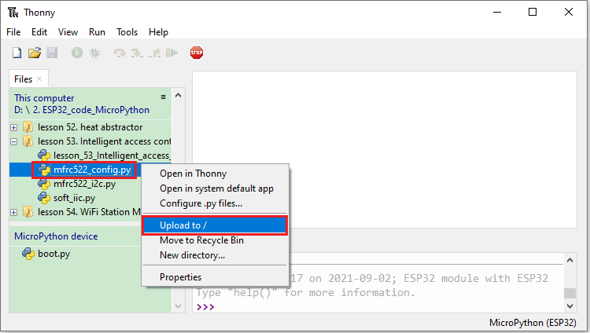

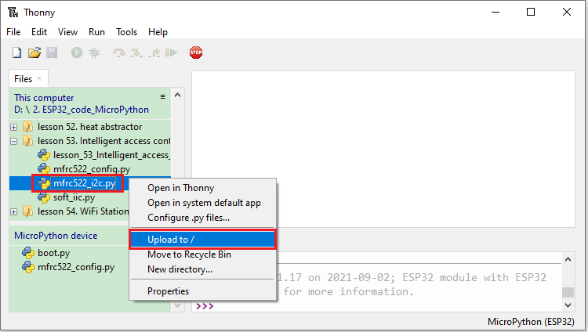

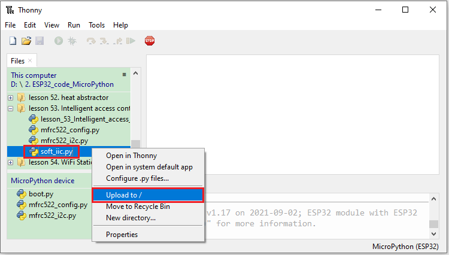

**5. Test Code：**

**Note: Different RFID-RC522 modules, ID cards and keys may different
uid1 values and uid2 values.** The uID1 and UID2 values of the white
card and key chain read by your RRFID RC522 module can be replaced by
the corresponding values in the program code. If not, click**“Run
current script” to r**un the code may cause your own white card and key
chain to fail to control the servo.  

For example: You can replace the UID1 and UID2 values In the program
code  with your own white card and key chain
values.

<table>
<tbody>
<tr class="odd">
<td>
from machine import Pin, PWM

import time

from mfrc522_i2c import mfrc522

pwm = PWM(Pin(15))

pwm.freq(50)

'''

Duty cycle corresponding to the Angle

Duty cycle corresponding to the Angle

0°----2.5%----25

45°----5%----51.2

90°----7.5%----77

135°----10%----102.4

180°----12.5%----128

'''

angle_0 = 25

angle_90 = 77

angle_180 = 128

#i2c config

addr = 0x28

scl = 22

sda = 21

rc522 = mfrc522(scl, sda, addr)

rc522.PCD_Init()

rc522.ShowReaderDetails() # Show details of PCD - MFRC522 Card Reader details

uid1 = [237, 247, 148, 90]

uid2 = [76, 9, 107, 110]

pwm.duty(angle_180)

time.sleep(1)

while True:

if rc522.PICC_IsNewCardPresent():

#print("Is new card present!")

if rc522.PICC_ReadCardSerial() == True:

print("Card UID:", end=' ')

print(rc522.uid.uidByte[0 : rc522.uid.size])

if rc522.uid.uidByte[0 : rc522.uid.size] == uid1 or rc522.uid.uidByte[0 : rc522.uid.size] == uid2:

pwm.duty(angle_0)

else :

pwm.duty(angle_180)

time.sleep(500)from machine import Pin, PWM

import time

from mfrc522_i2c import mfrc522

pwm = PWM(Pin(15))

pwm.freq(50)

'''

Duty cycle corresponding to the Angle

Duty cycle corresponding to the Angle

0°----2.5%----25

45°----5%----51.2

90°----7.5%----77

135°----10%----102.4

180°----12.5%----128

'''

angle_0 = 25

angle_90 = 77

angle_180 = 128

#i2c config

addr = 0x28

scl = 22

sda = 21

rc522 = mfrc522(scl, sda, addr)

rc522.PCD_Init()

rc522.ShowReaderDetails() # Show details of PCD - MFRC522 Card Reader details

uid1 = [237, 247, 148, 90]

uid2 = [76, 9, 107, 110]

pwm.duty(angle_180)

time.sleep(1)

while True:

if rc522.PICC_IsNewCardPresent():

#print("Is new card present!")

if rc522.PICC_ReadCardSerial() == True:

print("Card UID:", end=' ')

print(rc522.uid.uidByte[0 : rc522.uid.size])

if rc522.uid.uidByte[0 : rc522.uid.size] == uid1 or rc522.uid.uidByte[0 : rc522.uid.size] == uid2:

pwm.duty(angle_0)

else :

pwm.duty(angle_180)

time.sleep(500)
</td>
</tr>
</tbody>
</table>

**6. Code Explanation**

In the previous experiment, our RFID module has tested the information
of IC card and key. Then we use this corresponding information to
control the door.

**7. Test Result**

Wire up and power on. Click “Run current script”,
the code starts executing. When we use the IC card or blue key to swipe
the card, the shell displays the card and the key information , at the
same time, the servo rotates to the corresponding angle to simulate
opening the door. Press “Ctrl+C”or click
“Stop/Restart backend”to exit the program.

### Project 54：WIFI Station Mode

1.  **Description**

ESP32 has three different WiFi modes: Station mode, AP mode and
AP+Station mode. All WiFi programming projects must be configured with
WiFi running mode before using, otherwise the WiFi cannot be used. In
this project, we are going to learn the WiFi Station mode of the ESP32.

<table>
<tbody>
<tr class="odd">
<td><strong>Required Components</strong></td>
<td></td>
</tr>
<tr class="even">
<td>USB 线 x1</td>
<td>ESP32*1</td>
</tr>
</tbody>
</table>

**3. Wiring Diagram**

Plug the ESP32 to the USB port of your PC

**4. Component Knowledge**

**Station mode：**

When setting Station mode, the ESP32 is taken as a WiFi client. It can
connect to the router network and communicate with other devices on the
router via a WiFi connection. As shown in the figure below, the PC and
the router have been connected. If the ESP32 wants to communicate with
the PC, the PC and the router need to be connected.

**5.Test Code：**

<table>
<tbody>
<tr class="odd">
<td>
import time

import network # Import network module.

ssidRouter = 'ChinaNet-2.4G-0DF0' # Enter the router name

passwordRouter = 'ChinaNet@233' # Enter the router password

def STA_Setup(ssidRouter,passwordRouter):

print("Setup start")

sta_if = network.WLAN(network.STA_IF) # Set ESP32 in Station mode.

if not sta_if.isconnected():

print('connecting to',ssidRouter)

# Activate ESP32’s Station mode, initiate a connection request to the router

# and enter the password to connect.

sta_if.active(True)

sta_if.connect(ssidRouter,passwordRouter)

#Wait for ESP32 to connect to router until they connect to each other successfully.

while not sta_if.isconnected():

pass

# Print the IP address assigned to ESP32-WROVER in “Shell”.

print('Connected, IP address:', sta_if.ifconfig())

print("Setup End")

try:

STA_Setup(ssidRouter,passwordRouter)

except:

sta_if.disconnect()
</td>
</tr>
</tbody>
</table>

**6. Test Result**

Since the router name and password are different in various places, so
before running the code, the user needs to enter the correct router name
and password in the red box shown above.

After entering the correct router name and password, click
“Run current script”, the code will start
executing.

The Shell monitor will print the IP address of the ESP32 when connecting
the ESP32 to your router.

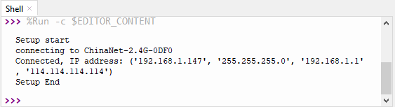

### Project 55：WIFI AP Mode

1.  **Description**

ESP32 has three different WiFi modes: Station mode, AP mode and
AP+Station mode. All WiFi programming projects must be configured with
WiFi running mode before using, otherwise the WiFi cannot be used. In
this project, we are going to learn the WiFi AP mode of the ESP32.

**2.Required Components**

<table>
<tbody>
<tr class="odd">
<td></td>
<td></td>
</tr>
<tr class="even">
<td>USB 线 x1</td>
<td>ESP32*1</td>
</tr>
</tbody>
</table>

**3. Wiring Diagram**

Plug the ESP32 mainboard to the USB port of your PC

**4. Component Knowledge**

**AP Mode:**

When setting AP mode, a hotspot network will be created, waiting for
other WiFi devices to connect. As shown below;

Take the ESP32 as the hotspot, if a phone or PC needs to communicate
with the ESP32, it must be connected to the ESP32's hotspot.
Communication is only possible after a connection is established via the
ESP32.

**5.Test Code：**

<table>
<tbody>
<tr class="odd">
<td>
import network #Import network module.

#Enter correct router name and password.

ssidAP = 'ESP32_WiFi' #Enter the router name

passwordAP = '12345678' #Enter the router password

local_IP = '192.168.1.147'

gateway = '192.168.1.1'

subnet = '255.255.255.0'

dns = '8.8.8.8'

#Set ESP32 in AP mode.

ap_if = network.WLAN(network.AP_IF)

def AP_Setup(ssidAP,passwordAP):

ap_if.ifconfig([local_IP,gateway,subnet,dns])

print("Setting soft-AP ... ")

ap_if.config(essid=ssidAP,authmode=network.AUTH_WPA_WPA2_PSK, password=passwordAP)

ap_if.active(True)

print('Success, IP address:', ap_if.ifconfig())

print("Setup End\n")

try:

AP_Setup(ssidAP,passwordAP)

except:

print("Failed, please disconnect the power and restart the operation.")

ap_if.disconnect()
</td>
</tr>
</tbody>
</table>

**6. Test Result**

You can modify the AP name and password or keep them unchanged

Click “Run current script”, the code will start
executing. Open the AP function of the ESP32, the Shell monitor will
print the information.

Turn on your phone's WiFi search function, then you can see the ssid\_AP
which is called "ESP32\_Wifi" in this code. You can enter the password
"12345678" to connect it, or you can modify its AP name and password by
code.

### Project 56：WIFI AP+Station Mode

1.  **Description**

In this project, we are going to learn the AP+Station mode of the ESP32.

**Components**

<table>
<tbody>
<tr class="odd">
<td></td>
<td></td>
</tr>
<tr class="even">
<td>USB Cable x1</td>
<td>ESP32*1</td>
</tr>
</tbody>
</table>

**3. Wiring Diagram**

Plug the ESP32 mainboard to the USB port of your PC

**4. Component Knowledge**

**AP+Station mode**

In addition to the AP mode and the Station mode, **AP+Station mode** can
be used at the same time. Turn on the Station mode of the ESP32, connect
it to the router network, and it can communicate with the Internet
through the router. Then turn on the AP mode to create a hotspot
network. Other WiFi devices can be connected to the router network or
the hotspot network to communicate with the ESP32.

**5.Test Code：**

<table>
<tbody>
<tr class="odd">
<td>
import network #Import network module.

ssidRouter = 'ChinaNet-2.4G-0DF0' #Enter the router name

passwordRouter = 'ChinaNet@233' #Enter the router password

ssidAP = 'ESP32_WiFi'#Enter the AP name

passwordAP = '12345678' #Enter the AP password

local_IP = '192.168.4.147'

gateway = '192.168.1.1'

subnet = '255.255.255.0'

dns = '8.8.8.8'

sta_if = network.WLAN(network.STA_IF)

ap_if = network.WLAN(network.AP_IF)

def STA_Setup(ssidRouter,passwordRouter):

print("Setting soft-STA ... ")

if not sta_if.isconnected():

print('connecting to',ssidRouter)

sta_if.active(True)

sta_if.connect(ssidRouter,passwordRouter)

while not sta_if.isconnected():

pass

print('Connected, IP address:', sta_if.ifconfig())

print("Setup End")

def AP_Setup(ssidAP,passwordAP):

ap_if.ifconfig([local_IP,gateway,subnet,dns])

print("Setting soft-AP ... ")

ap_if.config(essid=ssidAP,authmode=network.AUTH_WPA_WPA2_PSK, password=passwordAP)

ap_if.active(True)

print('Success, IP address:', ap_if.ifconfig())

print("Setup End\n")

try:

AP_Setup(ssidAP,passwordAP)

STA_Setup(ssidRouter,passwordRouter)

except:

sta_if.disconnect()

ap_if.idsconnect()
</td>
</tr>
</tbody>
</table>

**6. Test Result**

Before running the code, you need to modify ssidRouter, passwordRouter,
ssidAP, and passwordAP. After making sure that the code is modified
correctly, click “Run current script”and the
"Shell" window will display the following:

Then you can see the ssid\_A on the ESP32

### Project 57: Comprehensive Experiment

1.  **Introduction**

We did a lot of experiments, and for each one we needed to re-upload the
code, so can we achieve different functions through an experiment? In
this experiment, we will use an external button module to achieve
different functions.

**2.Required Components**

<table>
<tbody>
<tr class="odd">
<td></td>
<td></td>
<td></td>
<td></td>
<td></td>
<td></td>
</tr>
<tr class="even">
<td>ESP32 Board*1</td>
<td>ESP32 Expansion Board*1</td>
<td>Keyestudio Purple LED Module*1</td>
<td>Keyestudio Button Module*1</td>
<td>Keyestudio Rotary Potentiometer*1</td>
<td>Keyestudio Obstacle Avoidance Sensor*1</td>
</tr>
<tr class="odd">
<td></td>
<td></td>
<td></td>
<td></td>
<td></td>
<td></td>
</tr>
<tr class="even">
<td>Keyestudio Line Tracking Sensor*1</td>
<td>Keyestudio Joystick Module*1</td>
<td>Keyestudio HHC-SR04 Ultrasonic Sensor *1</td>
<td>Keyestudio Common Cathode RGB Module *1</td>
<td>Keyestudio XHT11 Temperature and Humidity Sensor *1</td>
<td>Micro USB Cable*1</td>
</tr>
<tr class="odd">
<td></td>
<td></td>
<td></td>
<td></td>
<td></td>
<td></td>
</tr>
<tr class="even">
<td>3P Dupont Wire*6</td>
<td>4P Dupont Wire*2</td>
<td>5P Dupont Wire*1</td>
<td></td>
<td></td>
<td></td>
</tr>
</tbody>
</table>

**3.Wiring Diagram**

**4.Test Code：**

<table>
<tbody>
<tr class="odd">
<td>
from machine import ADC, Pin, PWM

import time

import machine

import random

import dht

pwm_r = PWM(Pin(4))

pwm_g = PWM(Pin(0))

pwm_b = PWM(Pin(2))

pwm_r.freq(1000)

pwm_g.freq(1000)

pwm_b.freq(1000)

DHT = dht.DHT11(machine.Pin(15))

potentiometer_adc=ADC(Pin(33))

potentiometer_adc.atten(ADC.ATTN_11DB)

potentiometer_adc.width(ADC.WIDTH_12BIT)

button = Pin(23, Pin.IN)

led = PWM(Pin(5))

led.freq(1000)

tracking = Pin(14, Pin.IN, Pin.PULL_UP)

button_z=Pin(32,Pin.IN,Pin.PULL_UP)

rocker_x=ADC(Pin(35))

rocker_y=ADC(Pin(34))

rocker_x.atten(ADC.ATTN_11DB)

rocker_y.atten(ADC.ATTN_11DB)

rocker_x.width(ADC.WIDTH_12BIT)

rocker_y.width(ADC.WIDTH_12BIT)

avoid = Pin(27, Pin.IN)

# Set ultrasonic pins

trigger = Pin(13, Pin.OUT)

echo = Pin(12, Pin.IN)

def light(red, green, blue):

pwm_r.duty(red)

pwm_g.duty(green)

pwm_b.duty(blue)

# Ultrasonic ranging, unit: cm

def getDistance(trigger, echo):

# Generates a 10us square wave

trigger.value(0) #A short low level is given beforehand to ensure a clean high pulse:

time.sleep_us(2)

trigger.value(1)

time.sleep_us(10)#After pulling high, wait 10 microseconds and immediately set it to low

trigger.value(0)

while echo.value() == 0: #Establish a while loop to detect whether the echo pin value is 0 and record the time at that time

start = time.ticks_us()

while echo.value() == 1: #Establish a while loop to check whether the echo pin value is 1 and record the time at that time

end = time.ticks_us()

d = (end - start) * 0.0343 / 2 #The travel time of the sound wave x the speed of sound (343.2 m/s, 0.0343 cm/microsecond), and the distance back and forth divided by 2

return d

keys = 0

nums = 0

print(keys % 8)

def toggle_handle(pin):

global keys

keys += 1

print(keys % 7)

button.irq(trigger = Pin.IRQ_FALLING, handler = toggle_handle)

def showRGB():

R = random.randint(0,1023)

G = random.randint(0,1023)

B = random.randint(0,1023)

light(R, G, B)

time.sleep(0.3)

def showxht11():

DHT.measure()

print('temperature:',DHT.temperature(),'℃','humidity:',DHT.humidity(),'%')

time.sleep(1)

def showtracking():

if tracking.value() == 0:

print("0 White") #Press to print the corresponding information.

else:

print("1 Black")

time.sleep(0.1) #delay 0.1s

def showJoystick():

B_value = button_z.value()

X_value = rocker_x.read()

Y_value = rocker_y.read()

print("button:", end = " ")

print(B_value, end = " ")

print("X:", end = " ")

print(X_value, end = " ")

print("Y:", end = " ")

print(Y_value)

time.sleep(0.1)

def adjustLight():

pot_value = potentiometer_adc.read()

print(pot_value)

led.duty(pot_value)

time.sleep(0.1)

def showAvoid():

if avoid.value() == 0:

print("There are obstacles")

else:

print("All going well")

time.sleep(0.1)

def showDistance():

distance = getDistance(trigger, echo)

print("The distance is ： cm".format(distance))

time.sleep(0.1)

while True:

nums = keys % 7 #number of keystrokes mod 7 to get 0, 1, 2, 3, 4, 5, 6

if nums == 0: #According to RGB

showRGB()

elif nums == 1: #Displays the high and low level of the tracking sensor

showtracking()

elif nums == 2: #Display temperature and humidity

showxht11()

elif nums == 3: #Displays the rocker value

showJoystick()

elif nums == 4: #The potentiometer adjusts the LED

adjustLight()

elif nums == 5: #Display obstacle information

showAvoid()

elif nums == 6: #Display ultrasonic ranging value

showDistance()
</td>
</tr>
</tbody>
</table>

**Code Explanation**

Calculate how many times the button is pressed, divide it by 7, and get
the remainder which is 0, 1 2, 3, 4, 5 , 6. According to different
remainders, construct seven unique functions to realize different
functions.

We can add or reduce sensors or modules.

**Test Result**

Wire up, power on and click “Run current script”.
At the beginning, the number of keys is 0, the remainder is 0, and the
four lamp beads on the RGB module flash with random colors.

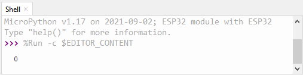

Press a button, the RGB stops flashing, press once, the remainder is 1.
The function of the experiment is to track the sensor according to black
and white objects read high and low levels, the following information is
displayed.

Press the key twice, the time of pressing buttons is 2 and the remainder
is 2. Read temperature and humidity values. As shown below;

Press the key again, the time of pressing buttons is 3 and the remainder
is 3. Read digital values at x, y and z axis of the joystick module. As
shown below;

Press the key for the fourth time, the remainder is 4. Then the
potentiometer can adjust the PWM value at the GPI05 port to control LED
brightness of the purple LED

Press the key for the fifth time, the remainder is 5. Then the obstacle
avoidance sensor can detect obstacles, as shown below;

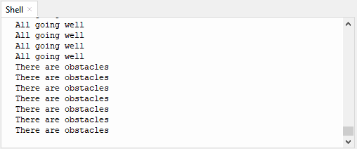

Press the key for the sixth time, the remainder is 6. Then the
ultrasonic sensor can detect distance away from obstacles, as shown
below;

Press the key for seventh time and the remainder is 0. The RGB will
flash again. Keep pressing the key, functions will change.
Press“Ctrl+C”or click “Stop/Restart
backend”to exit the program.

## 5. Resources

https://fs.keyestudio.com/KS5005-5006

